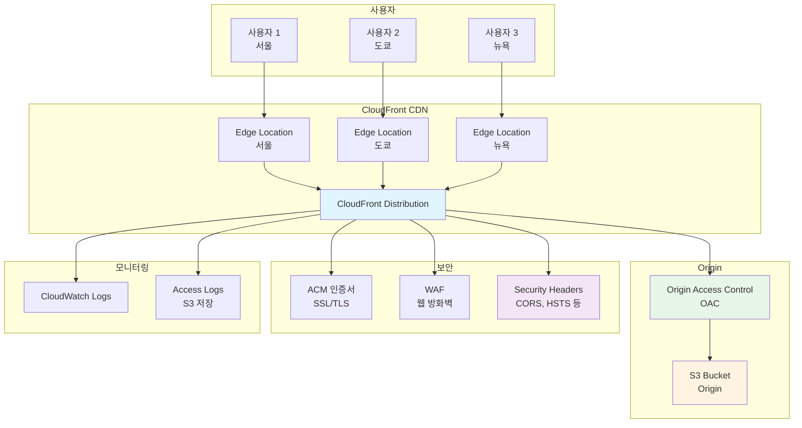
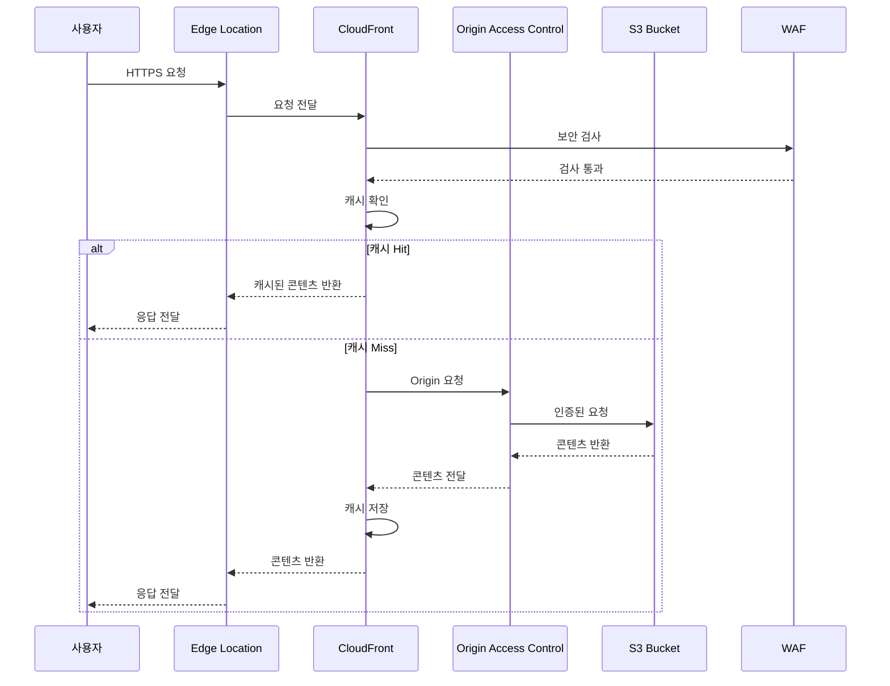
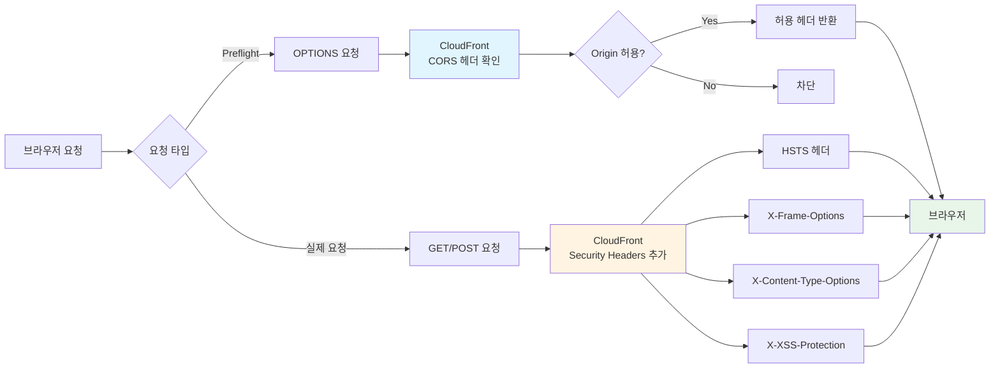

# CloudFront + S3 CORS 구성 및 보안 최적화 가이드

CloudFront, S3의 개념과 CORS의 필요성 및 보안적 위협요인에 대한 이해를 통합적으로 정리한 문서입니다.

## 🔰 개념 및 보안 이슈 요약

### ✅ Amazon S3란?

Amazon S3(Simple Storage Service)는 AWS에서 제공하는 객체 스토리지 서비스입니다. 주로 정적 웹사이트 호스팅이나 파일(이미지, 영상 등) 저장 용도로 많이 사용됩니다.

### ✅ CloudFront란?

CloudFront는 AWS가 제공하는 글로벌 CDN(콘텐츠 전송 네트워크) 서비스로, 웹 콘텐츠를 사용자에게 빠르고 효율적으로 전달합니다. S3 같은 원본(origin)의 콘텐츠를 캐싱하고 글로벌 엣지 로케이션에서 빠르게 제공합니다.

### ✅ CORS란? (Cross-Origin Resource Sharing)

CORS는 서로 다른 도메인 간의 자원 요청(리소스 요청)을 브라우저가 허용하도록 규정하는 보안 메커니즘입니다.

브라우저 보안 정책인 **동일 출처 정책(Same-Origin Policy)** 은 원칙적으로 서로 다른 도메인 간의 자원 접근을 제한합니다. 하지만 API, 이미지, 동영상과 같은 리소스를 외부 도메인에서 접근하려면 CORS 설정을 통해 접근을 명시적으로 허용해야 합니다.

#### 🔹 CORS가 필요한 이유
- API 요청이나 정적 콘텐츠를 서로 다른 도메인에서 안전하게 호출할 수 있도록 허용하기 위함입니다.
- CORS를 설정하지 않으면 브라우저가 외부 도메인의 리소스를 차단하여 서비스 이용이 어려워집니다.

## 🚨 CORS 설정 시 위협 요인 및 보안의 중요성

CORS를 잘못 설정하면 아래와 같은 보안 위협이 발생할 수 있습니다.

### ⚠️ 주요 위협 요인:
- 무분별한 허용(*) 설정 시 민감한 리소스 노출 위험
- 공격자가 악성 웹사이트를 통해 사용자의 브라우저에서 민감한 데이터에 접근하거나 변조 가능
- 잘못된 헤더 설정으로 불필요한 리소스 접근 허용, 데이터 탈취 가능성 존재

### 🔒 보안이 중요한 이유:
- CORS는 외부 도메인 접근 허용 여부를 결정하는 중요한 보안 정책입니다.
- 특히 금융정보, 개인정보와 같이 민감한 데이터가 포함된 API 및 콘텐츠 제공 시, 엄격하고 명시적인 CORS 정책이 필수적입니다.

## 🔐 CloudFront + Amazon S3의 CORS 구성 및 보안 최적화 가이드

### 📌 권장 구성 구조
```
[Client] 
  ↓ HTTPS
[CloudFront (CDN, Response Headers)]
  ↓ HTTPS (Origin Access Control)
[Amazon S3 (Origin)]
```

### 📍 권장 헤더 설정 값 (시간 환산)

| 헤더 | 설정값 | 분(Minute) | 시간(hour) | 일(day) |
|---|---|---|---|---|
| Access-Control-Max-Age | 600초 | 10분 | 0.1667시간 | 약 0.00694일 |
| Strict-Transport-Security | 31536000초 | 525600분 | 8760시간 | 365일 (1년) |

- **Access-Control-Max-Age** → 10분 (최적의 성능과 보안 균형)
- **Strict-Transport-Security** → 1년 (보안 최적 권장값)

### 📍 Amazon S3의 엄격한 CORS 구성 예시

AWS 콘솔 → S3 → 버킷 선택 → 권한 → CORS 구성:

```json
[
  {
    "AllowedHeaders": ["Authorization", "Content-Type", "X-Requested-With"],
    "AllowedMethods": ["GET", "HEAD", "OPTIONS"],
    "AllowedOrigins": ["https://mydomain.com"],
    "ExposeHeaders": ["ETag"],
    "MaxAgeSeconds": 600
  }
]
```

**중요 사항:**
- 반드시 명시된 특정 도메인만 허용 (절대 * 사용 금지)
- 최소한의 헤더와 메서드만 허용

### 📍 CloudFront의 Response Headers Policy 설정

AWS CloudFront → Policies → Response Headers Policy:

#### 🔸 CORS 권장 설정

| 항목 | 값 |
|---|---|
| Access-Control-Allow-Origin | https://mydomain.com |
| Access-Control-Allow-Methods | GET, HEAD, OPTIONS |
| Access-Control-Allow-Headers | Authorization, Content-Type |
| Access-Control-Max-Age | 600 |
| Access-Control-Expose-Headers | ETag |

#### 🔸 Security Headers 설정 (권장)

| 항목 | 값 |
|---|---|
| Strict-Transport-Security | max-age=31536000; includeSubDomains; preload |
| X-Content-Type-Options | nosniff |
| X-Frame-Options | DENY 또는 SAMEORIGIN |
| X-XSS-Protection | 1; mode=block |

### 📍 CloudFront Origin Access Control (OAC) 설정

CloudFront에서 S3 버킷에 직접 접근하지 못하도록 보안을 강화하는 설정:

1. **OAC 생성**: CloudFront 콘솔에서 Origin Access Control 생성
2. **S3 버킷 정책 업데이트**: CloudFront OAC만 접근 허용하도록 설정
3. **S3 퍼블릭 액세스 차단**: 모든 퍼블릭 액세스 차단 설정

```json
{
  "Version": "2012-10-17",
  "Statement": [
    {
      "Sid": "AllowCloudFrontServicePrincipal",
      "Effect": "Allow",
      "Principal": {
        "Service": "cloudfront.amazonaws.com"
      },
      "Action": "s3:GetObject",
      "Resource": "arn:aws:s3:::your-bucket-name/*",
      "Condition": {
        "StringEquals": {
          "AWS:SourceArn": "arn:aws:cloudfront::account-id:distribution/distribution-id"
        }
      }
    }
  ]
}
```

## 📌 월간 예상 비용 예시 (트래픽 1TB 기준)

| 서비스 | 항목 | 비용 | 비고 |
|---|---|---|---|
| Amazon S3 | 스토리지 | $0.025/GB | 월 1TB 사용시 약 $25.60 |
| CloudFront | 트래픽 | $0.114/GB (서울 기준) | 월 1TB 사용시 약 $116.74 |

**월 총 예상 비용: 약 $142.34**

## 🛡️ 추가 보안 권장사항

### 1. SSL/TLS 설정
- CloudFront에서 ACM(AWS Certificate Manager) 인증서 사용
- 최소 TLS 1.2 이상 강제 설정
- HTTP에서 HTTPS로 자동 리디렉션 설정

### 2. 캐시 정책 최적화
- 정적 리소스: 긴 캐시 TTL 설정 (1년)
- 동적 콘텐츠: 짧은 캐시 TTL 설정 (1시간)
- 적절한 Cache-Control 헤더 설정

### 3. 모니터링 및 로깅
- CloudFront 액세스 로그 활성화
- CloudWatch 모니터링 설정
- S3 액세스 로그 활성화

## 🎯 최종 권장 구성 요약 및 결론

- **CloudFront + S3** 구성은 성능과 보안을 균형있게 최적화합니다.
- **명시적이고 엄격한 CORS 정책**으로 데이터 보안 위협을 방지합니다.
- **Origin Access Control (OAC)**을 통해 S3 버킷을 보호합니다.
- **적절한 보안 헤더 설정**으로 다양한 웹 공격을 방어합니다.

이 구성을 통해 높은 보안성과 안정성을 갖춘 웹 인프라를 구축할 수 있습니다.

## 🏗️ CloudFront + S3 아키텍처

### 전체 CDN 아키텍처



### 요청 처리 흐름



### CORS 및 보안 헤더 흐름



## 🚀 프로젝트 구조

```
Cloudfront/
├── README.md                          # 이 문서
└── s3-cloudfront-cdn/                 # Terraform 구성 파일
    ├── main.tf                        # 메인 Terraform 설정
    ├── terraform.tfvars.example       # 변수 설정 예시
    ├── terraform.tfvars               # 실제 변수 설정 파일
    ├── README.md                      # 상세 구성 가이드
    └── test-content/                  # 테스트용 정적 콘텐츠
        ├── index.html
        └── test-image.svg
``` 