# AWS SSO (IAM Identity Center) and Control Tower Integration with Okta for Compliance (ISMS, Electronic Financial Regulations)

This document provides a guide for integrating **Okta** with **AWS IAM Identity Center (AWS SSO)** and implementing **AWS Control Tower** to manage AWS accounts and permissions more efficiently, while ensuring compliance with standards such as **ISMS-P** and **Electronic Financial Supervisory Regulations**.

## 📋 목차

- [개요](#overview)
- [Control Tower 아키텍처](#control-tower-아키텍처)
- [주요 기능](#주요-기능)
- [구현 단계](#implementation-steps)
- [컴플라이언스 고려사항](#compliance-considerations)
- [보안 및 비용 관리](#security-and-cost-management)

---

## 🏗️ Control Tower 아키텍처

### 전체 멀티 계정 아키텍처

```mermaid
graph TB
    subgraph "Identity Provider"
        Okta[Okta<br/>Identity Provider]
        Users[사용자/그룹]
    end
    
    subgraph "AWS Organizations"
        OrgRoot[Organization Root]
        ManagementAccount[Management Account<br/>Control Tower]
    end
    
    subgraph "AWS Control Tower"
        LandingZone[Landing Zone]
        AccountFactory[Account Factory]
        Guardrails[Guardrails<br/>보안 정책]
    end
    
    subgraph "AWS IAM Identity Center"
        IdentityCenter[IAM Identity Center<br/>AWS SSO]
        PermissionSets[Permission Sets<br/>권한 세트]
        Assignments[Account Assignments]
    end
    
    subgraph "멀티 계정 구조"
        LogArchive[Log Archive Account<br/>중앙 로깅]
        Audit[Audit Account<br/>감사]
        Security[Security Account<br/>보안]
        Dev[Dev Account<br/>개발]
        Prod[Prod Account<br/>프로덕션]
        SharedServices[Shared Services<br/>공유 서비스]
    end
    
    subgraph "중앙 관리 서비스"
        CloudTrail[CloudTrail<br/>API 로깅]
        Config[AWS Config<br/>규칙 준수]
        GuardDuty[GuardDuty<br/>위협 탐지]
        SCP[Service Control Policies<br/>SCP]
    end
    
    Users --> Okta
    Okta --> IdentityCenter
    IdentityCenter --> PermissionSets
    PermissionSets --> Assignments
    Assignments --> Dev
    Assignments --> Prod
    Assignments --> Security
    
    ManagementAccount --> LandingZone
    LandingZone --> AccountFactory
    AccountFactory --> Dev
    AccountFactory --> Prod
    AccountFactory --> SharedServices
    
    LandingZone --> Guardrails
    Guardrails --> SCP
    SCP --> Dev
    SCP --> Prod
    SCP --> Security
    
    Dev --> CloudTrail
    Prod --> CloudTrail
    Security --> CloudTrail
    CloudTrail --> LogArchive
    
    Dev --> Config
    Prod --> Config
    Config --> Audit
    
    Dev --> GuardDuty
    Prod --> GuardDuty
    GuardDuty --> Security
    
    style ManagementAccount fill:#e1f5ff
    style IdentityCenter fill:#fff4e1
    style LogArchive fill:#e8f5e9
    style Guardrails fill:#f3e5f5
```

### 계정 생성 및 권한 할당 흐름

```mermaid
sequenceDiagram
    participant Admin as 관리자
    participant CT as Control Tower
    participant AF as Account Factory
    participant Org as Organizations
    participant SSO as IAM Identity Center
    participant Account as 새 계정
    
    Admin->>CT: Account Factory 접근
    Admin->>AF: 새 계정 생성 요청
    AF->>Org: 계정 생성
    Org->>Account: 계정 프로비저닝
    Account-->>AF: 계정 ID 반환
    
    AF->>Account: Guardrails 적용
    AF->>Account: SCP 적용
    AF->>Account: CloudTrail 설정
    AF->>Account: Config 설정
    
    Admin->>SSO: Permission Set 생성
    SSO->>SSO: 권한 세트 정의
    
    Admin->>SSO: 계정 할당
    SSO->>Account: IAM Role 생성
    SSO->>SSO: 사용자/그룹 연결
    
    Account-->>Admin: 계정 준비 완료
```

### 로깅 및 감사 흐름

```mermaid
graph LR
    subgraph "멀티 계정"
        Account1[Account 1]
        Account2[Account 2]
        Account3[Account 3]
    end
    
    subgraph "중앙 로깅"
        CloudTrail[CloudTrail Logs]
        ConfigLogs[Config Snapshots]
        VPCFlowLogs[VPC Flow Logs]
    end
    
    subgraph "Log Archive Account"
        S3[S3 Bucket<br/>로그 저장]
        Athena[Athena<br/>로그 분석]
    end
    
    subgraph "Audit Account"
        SecurityTeam[보안 팀]
        Compliance[컴플라이언스 검토]
    end
    
    Account1 --> CloudTrail
    Account2 --> CloudTrail
    Account3 --> CloudTrail
    
    Account1 --> ConfigLogs
    Account2 --> ConfigLogs
    Account3 --> ConfigLogs
    
    CloudTrail --> S3
    ConfigLogs --> S3
    VPCFlowLogs --> S3
    
    S3 --> Athena
    Athena --> SecurityTeam
    Athena --> Compliance
    
    style S3 fill:#e1f5ff
    style Athena fill:#fff4e1
    style SecurityTeam fill:#e8f5e9
```

### SSO 인증 및 권한 흐름

```mermaid
sequenceDiagram
    participant User as 사용자
    participant Okta as Okta
    participant SSO as IAM Identity Center
    participant Account as AWS Account
    participant Role as IAM Role
    participant Service as AWS Service
    
    User->>Okta: 로그인
    Okta->>Okta: 인증 확인
    Okta-->>User: 인증 토큰
    
    User->>SSO: AWS 접근 요청
    SSO->>Okta: SAML 인증 확인
    Okta-->>SSO: 인증 성공
    
    SSO->>SSO: Permission Set 확인
    SSO->>SSO: 계정 할당 확인
    SSO->>Account: 임시 자격 증명 생성
    Account->>Role: AssumeRole
    Role-->>Account: 임시 자격 증명
    Account-->>SSO: 자격 증명 반환
    SSO-->>User: AWS 콘솔 접근
    
    User->>Service: API 호출
    Service->>Role: 권한 확인
    Role-->>Service: 권한 허용
    Service-->>User: 응답 반환
```

---

## Overview

Integrating **Okta** with **AWS IAM Identity Center (AWS SSO)** streamlines user management, enhances security, and improves operational efficiency across multiple AWS accounts. The implementation of **AWS Control Tower** enables centralized governance, making it easier to manage security, compliance, and account provisioning at scale. These solutions help organizations meet strict compliance requirements like ISMS-P and the **Electronic Financial Supervisory Regulations** by ensuring consistent security policies and centralized logging.

---

## 1. Benefits and Changes

### 1-0. Current Issues with AWS Account and Permission Management

#### Difficulty in Horizontal Scalability
- As AWS accounts increase in complexity, scaling operations or experimenting with new technologies becomes difficult.
- Without centralized management, creating new accounts or environments requires substantial effort and communication.
- **Example**: Establishing test environments for services like RabbitMQ or Kafka can become labor-intensive.

#### Difficulty in Applying Security Policies
- Applying consistent security policies across all AWS accounts is challenging. Manually configuring services like **CloudTrail**, **GuardDuty**, and **AWS Config** increases the risk of inconsistencies.
- **Example**: Standardizing VPC endpoint policies, security group rules, and IAM policies across accounts requires considerable time and effort.

#### Complexity in Permission Management
- Managing permissions across multiple AWS accounts involves separate IAM roles, users, and policies, leading to a fragmented, difficult-to-manage environment.
- Users may not fully understand their permissions or which IAM roles are necessary, leading to potential security risks or inefficiency.

### 1-1. AWS Control Tower

**AWS Control Tower** is a managed service that helps organizations set up and govern secure, multi-account AWS environments following best practices.

#### Key Benefits

- **Centralized Logging and Security**: AWS Control Tower enables centralized logging for all AWS accounts, using a **Log Archive** account and an **Audit** account. This approach ensures compliance with security regulations like ISMS-P, as all logs are stored centrally and securely.
- **Scalable Account Creation**: The **Account Factory** feature automates the creation of AWS accounts with pre-configured security and compliance settings, making it easier to scale the environment.
- **Compliance Enforcement**: Control Tower provides pre-configured **guardrails** that enforce security and compliance policies across all accounts, helping organizations meet ISMS and electronic financial regulatory requirements.

#### As-Is vs To-Be

| As-Is                                              | To-Be                                              |
|----------------------------------------------------|----------------------------------------------------|
| Manual account creation without standards          | Automated account creation with Account Factory    |
| No centralized logging and audit accounts          | Centralized Log Archive and Audit accounts         |
| Inconsistent security configurations across accounts | Consistent security policies across all accounts  |

#### Additional Features

- **Guardrails**: Control Tower includes pre-configured **guardrails** to enforce governance and security rules across all accounts. This simplifies compliance with regulations like ISMS-P.
- **Single Sign-On**: By integrating **AWS IAM Identity Center (AWS SSO)** with Okta, users can access all AWS accounts with a single set of credentials, improving user experience and reducing complexity.

For more information, see the [AWS Control Tower documentation](https://docs.aws.amazon.com/controltower/latest/userguide/what-is-control-tower.html).

### 1-2. AWS IAM Identity Center (AWS SSO) with Okta Integration

**AWS IAM Identity Center (AWS SSO)** integration with **Okta** simplifies identity and access management for multiple AWS accounts, ensuring compliance with regulations such as **ISMS-P** and **Electronic Financial Supervisory Regulations**.

#### Key Benefits

- **Improved User Experience**: Users can access AWS accounts via a single sign-on (SSO) portal, eliminating the need for separate IAM users and reducing administrative overhead.
- **Increased Security**: Long-term credentials, such as IAM access keys and passwords, are replaced with temporary credentials issued through Okta and AWS SSO, improving security.
- **Centralized Permission Management**: Permissions are managed through AWS SSO and consolidated into a single IAM role for each account. This simplifies compliance with security policies and reduces management complexity.

#### As-Is vs To-Be

| As-Is                                              | To-Be                                              |
|----------------------------------------------------|----------------------------------------------------|
| Separate IAM users for console and CLI access      | Okta-based SSO with a single IAM role per account |
| Manual password and access key management          | No long-term credentials, temporary SSO credentials |
| Separate permissions for each user across accounts | Centralized permissions through AWS SSO            |

For more details, refer to the [AWS IAM Identity Center (AWS SSO) documentation](https://docs.aws.amazon.com/singlesignon/latest/userguide/what-is.html).

---

## 2. Implementation Steps

### 2-1. AWS Control Tower Setup

1. **Create a Landing Zone**: Deploy AWS Control Tower to establish a secure, multi-account AWS environment. This will automate governance and security enforcement across accounts.
2. **Configure the Account Factory**: Use the Account Factory feature to automate the creation of AWS accounts with pre-configured security and compliance settings, ensuring that new accounts adhere to corporate security policies.
3. **Apply Guardrails**: Configure mandatory and elective guardrails for compliance, security, and operational governance. These guardrails help enforce security policies that comply with ISMS and other regulatory standards.
4. **Enable Centralized Logging**: Set up centralized logging for all AWS accounts by configuring a **Log Archive** and **Audit** account. This ensures that all account activity is logged in a secure, compliant manner.

### 2-2. AWS SSO and Okta Integration Setup

1. **Set Up AWS IAM Identity Center (AWS SSO)**: Configure AWS IAM Identity Center (AWS SSO) to handle access management for all AWS accounts within the organization.
2. **Integrate with Okta**: Use Okta as the Identity Provider (IdP) for AWS SSO, allowing users to authenticate through Okta and access AWS accounts using a single sign-on.
3. **Define Permission Sets**: Create and assign permission sets in AWS SSO that define the roles and permissions users need to access specific AWS accounts.
4. **Migrate Users**: Transition existing IAM users to AWS SSO, enabling Okta integration and reducing the need for long-term credentials like IAM access keys and passwords.

---

## 3. Compliance Considerations

### 3-1. ISMS-P Compliance

The **ISMS-P** (Information Security Management System & Personal Information Protection System) standard requires organizations to implement stringent security controls across their IT environments. AWS Control Tower and AWS SSO with Okta provide the necessary tools to enforce these controls consistently.

- **Centralized Logging**: Control Tower’s centralized logging capabilities ensure that all security events are captured and stored securely, meeting ISMS-P logging and monitoring requirements.
- **Access Control**: AWS SSO and Okta enforce strong access controls, ensuring that only authorized users can access critical systems, a key ISMS-P requirement.
- **Data Protection**: AWS encryption services such as **KMS** (Key Management Service) and **ACM** (AWS Certificate Manager) ensure that sensitive data is protected in transit and at rest.

### 3-2. Electronic Financial Supervisory Regulations

AWS Control Tower and AWS SSO also help organizations comply with the **Electronic Financial Supervisory Regulations**, which govern the use of cloud services in the financial sector.

- **Separation of Duties**: Control Tower enables account separation for development, production, and testing environments, ensuring that the principle of least privilege is enforced.
- **Auditing and Monitoring**: Centralized logging and CloudTrail auditing features help meet the stringent auditing requirements outlined in the Electronic Financial Supervisory Regulations.
- **Data Integrity**: Encryption and secure data storage meet regulatory requirements for protecting financial data and ensuring data integrity.

---

## 4. Security and Cost Management

### 4-1. Security Best Practices

- **Use Guardrails**: Ensure that AWS Control Tower guardrails are configured to enforce compliance with corporate and regulatory security policies.
- **SCP (Service Control Policies)**: Implement SCPs across the AWS organization to restrict actions that could lead to non-compliance or security vulnerabilities.

### 4-2. Cost Management

- **Cost Optimization**: Control Tower helps reduce operational overhead by automating account creation and governance. Ensure proper lifecycle management for logs and CloudTrail data to optimize costs.
- **S3 Lifecycle Policies**: Implement lifecycle policies for S3 storage to automatically move data to lower-cost storage tiers, such as Glacier, to optimize long-term storage costs.

---

## Conclusion

Integrating Okta with AWS IAM Identity Center (AWS SSO) and deploying AWS Control Tower streamlines AWS account management, enhances security, and ensures compliance with regulations like ISMS-P and the **Electronic Financial Supervisory Regulations**. By centralizing governance, logging, and permissions management, organizations can improve operational efficiency while reducing complexity and security risks.

For further information, refer to the official AWS documentation for [AWS Control Tower](https://docs.aws.amazon.com/controltower/latest/userguide/what-is-control-tower.html) and [AWS SSO](https://docs.aws.amazon.com/singlesignon/latest/userguide/what-is.html).
