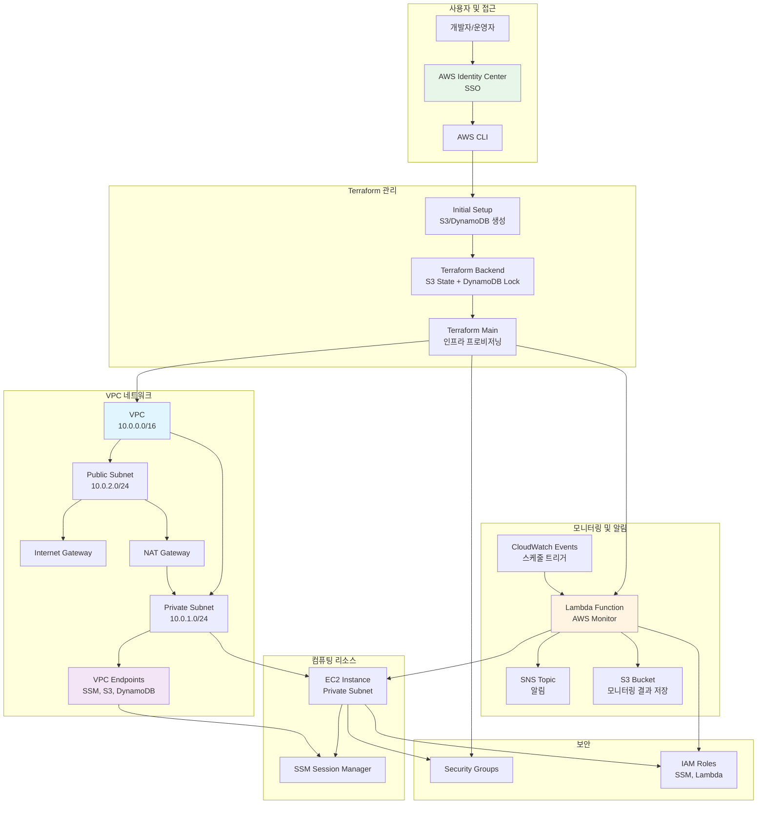
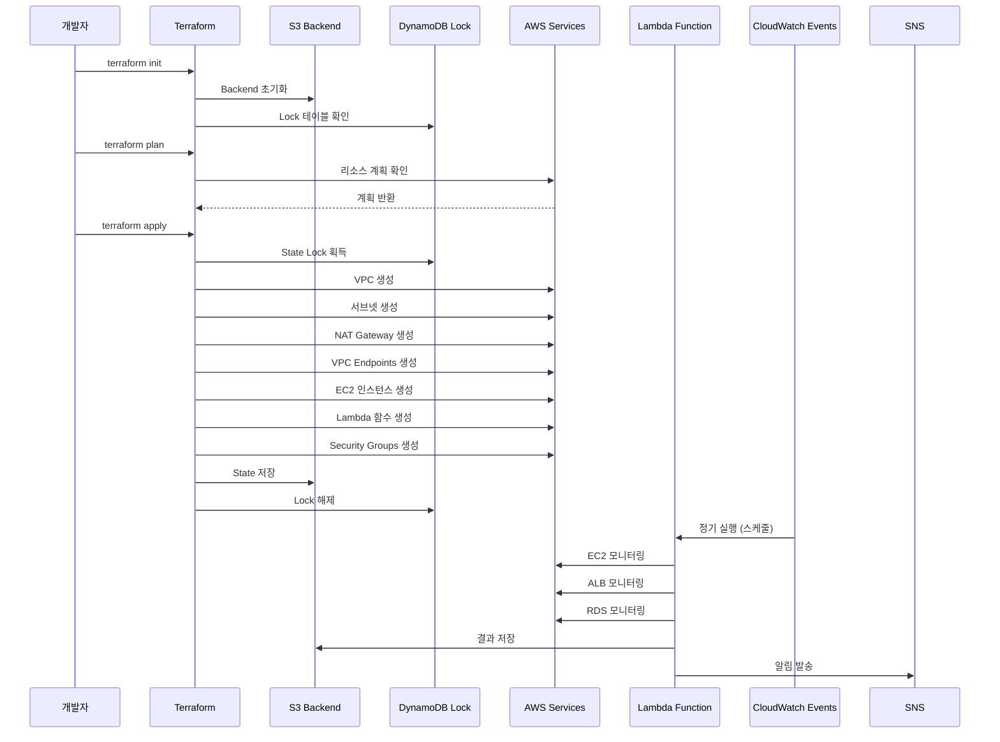
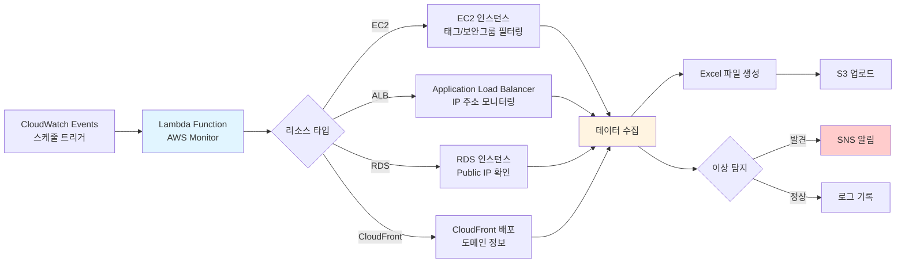

# AWS Infrastructure Automation with Terraform and AWS Identity Center (SSO)

이 프로젝트는 Terraform을 사용하여 AWS 인프라를 자동으로 프로비저닝하고 관리하며, AWS Identity Center (이전의 AWS SSO)를 통해 안전한 접근 및 인증을 제공합니다. 인프라에는 VPC, 서브넷, 보안 그룹, EC2 인스턴스, 모니터링을 위한 Lambda 함수, Terraform 상태 잠금을 위한 DynamoDB 테이블 등이 포함됩니다. 알림은 AWS SNS를 통해 관리됩니다.

## 목차

1. [사전 요구 사항](#사전-요구-사항)
2. [프로젝트 구조](#프로젝트-구조)
3. [AWS Identity Center (SSO) 설정](#aws-identity-center-sso-설정)
4. [Terraform 백엔드 초기 설정](#terraform-백엔드-초기-설정)
5. [Terraform 백엔드 구성](#terraform-백엔드-구성)
6. [인프라 프로비저닝](#인프라-프로비저닝)
7. [Lambda 함수 배포](#lambda-함수-배포)
8. [AWS 리소스 모니터링](#aws-리소스-모니터링)
9. [보안 고려 사항](#보안-고려-사항)
10. [정리](#정리)
11. [문제 해결 팁](#문제-해결-팁)
12. [추가 참고 자료](#추가-참고-자료)

---

## 사전 요구 사항

프로젝트를 시작하기 전에 다음 요구 사항을 충족해야 합니다:

- **AWS 계정**: 활성화된 AWS 계정이 필요합니다.
- **Terraform 설치**: [Terraform 다운로드 및 설치](https://www.terraform.io/downloads.html).
- **AWS CLI 설치**: [AWS CLI 다운로드 및 설치](https://aws.amazon.com/cli/).
- **Python 설치**: Lambda 함수 및 모니터링 스크립트를 위해 필요합니다.
- **AWS Identity Center (SSO) 설정**: 안전한 접근 관리를 위해 필요합니다.

---

## 프로젝트 구조

프로젝트는 다음과 같은 구조로 구성됩니다:

```
myproject/
├── initial_setup/
│   ├── main.tf
│   ├── variables.tf
│   ├── outputs.tf
│   └── provider.tf
├── terraform/
│   ├── main.tf
│   ├── variables.tf
│   ├── outputs.tf
│   ├── backend.tf
│   ├── modules/
│   │   ├── lambda/
│   │   │   ├── main.tf
│   │   │   ├── variables.tf
│   │   │   └── outputs.tf
│   │   ├── dynamodb/
│   │   │   ├── state_lock.tf
│   │   │   ├── variables.tf
│   │   │   └── outputs.tf
│   │   └── vpc_endpoints/
│   │       ├── main.tf
│   │       ├── variables.tf
│   │       └── outputs.tf
│   └── ... (기타 모듈이나 리소스)
├── lambda/
│   └── aws_monitor.py
├── requirements.txt
├── build_lambda.sh
├── README.md
└── scripts/
    └── aws_monitor_local.py
```

### 디렉토리 설명

- **initial_setup/**: Terraform을 사용하여 백엔드용 S3 버킷과 DynamoDB 테이블을 생성합니다.
  - `provider.tf`: AWS 프로바이더 설정.
  - `main.tf`: S3 버킷과 DynamoDB 테이블 생성.
  - `variables.tf`: 변수 정의 (현재 필요 시 추가).
  - `outputs.tf`: 출력 값 정의.

- **terraform/**: 주요 Terraform 구성 파일과 모듈을 포함합니다.
  - `main.tf`: 전체 인프라를 정의하고 모듈을 호출.
  - `variables.tf`: 전체 프로젝트에서 사용하는 변수 정의.
  - `outputs.tf`: Terraform 실행 후 출력될 값 정의.
  - `backend.tf`: Terraform 백엔드 설정.
  - **modules/**: 재사용 가능한 Terraform 모듈.
    - **lambda/**: AWS Lambda 관련 리소스를 정의하는 모듈.
    - **dynamodb/**: DynamoDB 상태 잠금 테이블을 정의하는 모듈.
    - **vpc_endpoints/**: VPC 엔드포인트 관련 리소스를 정의하는 모듈.

- **lambda/**: Lambda 함수의 소스 코드를 포함.
- **requirements.txt**: Python 의존성 관리 파일.
- **build_lambda.sh**: Lambda 함수를 패키징하는 스크립트.
- **scripts/**: 추가적인 스크립트를 포함.
- **README.md**: 프로젝트 설명서.

---

## 🏗️ EC2 인프라 아키텍처

### 전체 시스템 아키텍처



### 인프라 프로비저닝 흐름



### 모니터링 시스템 흐름



---

## AWS Identity Center (SSO) 설정

AWS Identity Center (SSO)는 AWS 리소스에 대한 중앙 집중식 접근 관리를 제공합니다. Terraform을 사용하여 인프라를 관리할 때 보안을 강화할 수 있습니다.

### 1. AWS Identity Center 활성화

1. **AWS 관리 콘솔에 로그인**합니다.
2. **AWS Identity Center**(이전의 AWS SSO)로 이동합니다.
3. **AWS Identity Center 활성화**: 활성화되지 않은 경우, 활성화 단계를 따라 진행합니다.

### 2. 아이덴티티 소스 구성

1. **아이덴티티 소스 선택**:
   - AWS Identity Center를 아이덴티티 소스로 사용할지, 외부 아이덴티티 제공자(예: Active Directory)와 통합할지 선택합니다.
   
2. **사용자 및 그룹 생성**:
   - AWS 리소스에 접근할 사용자와 그룹을 생성합니다.

### 3. 권한 할당

1. **권한 세트 생성**:
   - 사용자가 가질 AWS IAM 역할을 정의하는 권한 세트를 생성합니다.
   
2. **사용자/그룹에 권한 할당**:
   - 생성한 권한 세트를 특정 AWS 계정과 사용자/그룹에 할당합니다.

### 4. AWS CLI SSO 구성

1. **AWS CLI SSO 구성**:
   ```bash
   aws configure sso
   ```
   프롬프트에 따라 SSO 로그인 및 프로파일 설정을 진행합니다.

2. **구성 확인**:
   ```bash
   aws sts get-caller-identity --profile <your-profile-name>
   ```
   SSO 프로파일을 사용하여 AWS CLI 명령어가 정상적으로 작동하는지 확인합니다.

---

## Terraform 백엔드 초기 설정

Terraform 상태 파일을 안전하게 관리하고 팀 내에서의 동시 작업을 방지하기 위해 S3와 DynamoDB를 백엔드로 설정합니다. 이를 위해 `initial_setup` 디렉토리에서 백엔드 리소스를 먼저 생성합니다.

### 1. 초기 설정 디렉토리 구성

`initial_setup/` 디렉토리 내에 다음 파일들을 생성합니다.

#### `initial_setup/provider.tf`
```hcl
provider "aws" {
  region = "ap-northeast-2"
}
```

#### `initial_setup/main.tf`
```hcl
resource "aws_s3_bucket" "terraform_state_bucket" {
  bucket = "aws-sso-tfstate"
  
  acl    = "private"

  tags = {
    Name        = "TerraformStateBucket"
    ManagedBy   = "Terraform"
    Environment = "Production"
  }
}

resource "aws_dynamodb_table" "terraform_state_lock" {
  name         = "TerraformStateLock"
  billing_mode = "PAY_PER_REQUEST"
  hash_key     = "LockID"

  attribute {
    name = "LockID"
    type = "S"
  }

  tags = {
    Name      = "TerraformStateLock"
    ManagedBy = "Terraform"
  }
}
```

#### `initial_setup/variables.tf`
```hcl
# 필요 시 변수 정의
```

#### `initial_setup/outputs.tf`
```hcl
output "s3_bucket_name" {
  description = "The name of the S3 bucket for Terraform state."
  value       = aws_s3_bucket.terraform_state_bucket.bucket
}

output "dynamodb_table_name" {
  description = "The name of the DynamoDB table for Terraform state locking."
  value       = aws_dynamodb_table.terraform_state_lock.name
}
```

### 2. 초기 Terraform 적용

1. **초기 설정 디렉토리로 이동**:
   ```bash
   cd initial_setup
   ```
   
2. **Terraform 초기화**:
   ```bash
   terraform init
   ```
   
3. **Terraform 적용**:
   ```bash
   terraform apply -auto-approve
   ```
   
   이 명령어는 S3 버킷과 DynamoDB 테이블을 생성합니다.

---

## Terraform 백엔드 구성

백엔드 설정을 통해 Terraform 상태 파일을 S3에 저장하고, DynamoDB를 사용하여 상태 잠금을 관리합니다.

### `terraform/backend.tf`
```hcl
terraform {
  backend "s3" {
    bucket         = "aws-sso-tfstate"                         # S3 버킷 이름
    key            = "iam_identity_center/terraform.tfstate"    # 상태 파일 경로
    region         = "ap-northeast-2"                          # S3 버킷 지역
    dynamodb_table = "TerraformStateLock"                      # DynamoDB 테이블 이름
    encrypt        = true                                      # 상태 파일 암호화
    acl            = "bucket-owner-full-control"
  }
}
```

> **주의:** `initial_setup` 단계에서 S3 버킷과 DynamoDB 테이블이 생성되었는지 확인하세요. 그렇지 않다면, 백엔드 초기화가 실패할 수 있습니다.

### Terraform 초기화

백엔드 설정을 적용하기 위해 `terraform/` 디렉토리에서 Terraform을 초기화합니다.

1. **Terraform 디렉토리로 이동**:
   ```bash
   cd ../terraform
   ```
   
2. **Terraform 초기화**:
   ```bash
   terraform init
   ```

---

## 인프라 프로비저닝

Terraform을 사용하여 AWS 인프라를 프로비저닝합니다. 이 단계에서는 VPC, 서브넷, 인터넷 게이트웨이, NAT 게이트웨이, 보안 그룹, EC2 인스턴스, Lambda 함수, SNS 토픽 등이 생성됩니다.

### `terraform/main.tf`
```hcl
provider "aws" {
  region = "ap-northeast-2"
}

# VPC
resource "aws_vpc" "myproject_prod_vpc" {
  cidr_block = "10.0.0.0/16"

  tags = {
    Name                = "myproject-prod-vpc"
    ManagedBy           = "Terraform"
    ModificationLocked = "true"
  }
}

# Public Subnet
resource "aws_subnet" "myproject_prod_public_subnet" {
  vpc_id            = aws_vpc.myproject_prod_vpc.id
  cidr_block        = "10.0.2.0/24"
  availability_zone = "ap-northeast-2a"

  tags = {
    Name                = "myproject-prod-public-subnet"
    ManagedBy           = "Terraform"
    ModificationLocked = "true"
  }
}

# Private Subnet
resource "aws_subnet" "myproject_prod_private_subnet" {
  vpc_id            = aws_vpc.myproject_prod_vpc.id
  cidr_block        = "10.0.1.0/24"
  availability_zone = "ap-northeast-2a"

  tags = {
    Name                = "myproject-prod-private-subnet"
    ManagedBy           = "Terraform"
    ModificationLocked = "true"
  }
}

# Internet Gateway
resource "aws_internet_gateway" "myproject_prod_igw" {
  vpc_id = aws_vpc.myproject_prod_vpc.id

  tags = {
    Name      = "myproject-prod-igw"
    ManagedBy = "Terraform"
  }
}

# Elastic IP for NAT Gateway
resource "aws_eip" "myproject_prod_eip" {
  vpc = true
}

# NAT Gateway
resource "aws_nat_gateway" "myproject_prod_nat_gateway" {
  allocation_id = aws_eip.myproject_prod_eip.id
  subnet_id     = aws_subnet.myproject_prod_public_subnet.id

  tags = {
    Name      = "myproject-prod-nat-gateway"
    ManagedBy = "Terraform"
  }
}

# Public Route Table
resource "aws_route_table" "myproject_prod_public_rt" {
  vpc_id = aws_vpc.myproject_prod_vpc.id

  route {
    cidr_block = "0.0.0.0/0"
    gateway_id = aws_internet_gateway.myproject_prod_igw.id
  }

  tags = {
    Name      = "myproject-prod-public-rt"
    ManagedBy = "Terraform"
  }
}

# Associate Route Table with Public Subnet
resource "aws_route_table_association" "myproject_prod_public_rt_association" {
  subnet_id      = aws_subnet.myproject_prod_public_subnet.id
  route_table_id = aws_route_table.myproject_prod_public_rt.id
}

# IAM Role for SSM Access
resource "aws_iam_role" "myproject_prod_ssm_role" {
  name = "myproject-prod-ssm-role"

  assume_role_policy = jsonencode({
    Version = "2012-10-17",
    Statement = [
      {
        Effect    = "Allow",
        Principal = {
          Service = "ec2.amazonaws.com"
        },
        Action = "sts:AssumeRole"
      }
    ]
  })

  tags = {
    ManagedBy           = "Terraform"
    ModificationLocked = "true"
  }
}

# Attach SSM Policy to IAM Role
resource "aws_iam_role_policy_attachment" "myproject_prod_ssm_policy_attachment" {
  role       = aws_iam_role.myproject_prod_ssm_role.name
  policy_arn = "arn:aws:iam::aws:policy/AmazonSSMManagedInstanceCore"
}

# IAM Instance Profile for EC2
resource "aws_iam_instance_profile" "myproject_prod_ssm_profile" {
  name = "myproject-prod-ssm-instance-profile"
  role = aws_iam_role.myproject_prod_ssm_role.name

  tags = {
    ManagedBy           = "Terraform"
    ModificationLocked = "true"
  }
}

# Security Group for VPC Endpoints (Dedicated for VPC Endpoints)
resource "aws_security_group" "myproject_prod_vpc_endpoint_sg" {
  name        = "myproject-prod-vpc-endpoint-sg"
  description = "Security group for VPC Endpoints"
  vpc_id      = aws_vpc.myproject_prod_vpc.id

  # Ingress rule: Allow only HTTPS traffic for SSM and other services
  ingress {
    from_port   = 443
    to_port     = 443
    protocol    = "tcp"
    cidr_blocks = ["10.0.0.0/16"]  # VPC 내 트래픽만 허용
  }

  egress {
    from_port   = 0
    to_port     = 0
    protocol    = "-1"
    cidr_blocks = ["0.0.0.0/0"]
  }

  tags = {
    Name                = "myproject-prod-vpc-endpoint-sg"
    ManagedBy           = "Terraform"
    ModificationLocked = "true"
  }
}

# Security Group for EC2 Instance (Allow access only from VPC Endpoints)
resource "aws_security_group" "myproject_prod_ec2_sg" {
  name        = "myproject-prod-ec2-sg"
  description = "Security group for EC2 to allow SSM access"
  vpc_id      = aws_vpc.myproject_prod_vpc.id

  # Ingress rule: Allow HTTPS traffic from the VPC Endpoint's security group
  ingress {
    from_port       = 443
    to_port         = 443
    protocol        = "tcp"
    security_groups = [aws_security_group.myproject_prod_vpc_endpoint_sg.id]  # VPC 엔드포인트로부터의 트래픽만 허용
  }

  egress {
    from_port   = 0
    to_port     = 0
    protocol    = "-1"
    cidr_blocks = ["0.0.0.0/0"]
  }

  tags = {
    Name                = "myproject-prod-ec2-sg"
    ManagedBy           = "Terraform"
    ModificationLocked = "true"
  }
}

# EC2 Instance in Private Subnet
resource "aws_instance" "myproject_prod_private_instance" {
  ami                         = "ami-01123b84e2a4fba05"  # ap-northeast-2의 Amazon Linux 2 AMI
  instance_type               = "t2.micro"
  subnet_id                   = aws_subnet.myproject_prod_private_subnet.id
  associate_public_ip_address = false
  security_groups             = [aws_security_group.myproject_prod_ec2_sg.id]
  iam_instance_profile        = aws_iam_instance_profile.myproject_prod_ssm_profile.name

  # SSM Agent 설치 스크립트
  user_data = <<-EOF
    #!/bin/bash
    yum install -y amazon-ssm-agent
    systemctl enable amazon-ssm-agent
    systemctl start amazon-ssm-agent
  EOF

  tags = {
    Name                = "myproject-prod-private-instance"
    ManagedBy           = "Terraform"
    ModificationLocked = "true"
    Usage               = "prod-name"        # Python 스크립트에서 필터링할 'Usage' 태그 추가
    HostName            = "prod-hostname"    # 필요 시 추가
  }
}

# SNS Topic for Lambda Notifications
resource "aws_sns_topic" "aws_monitor_topic" {
  name = "aws-monitor-topic"

  tags = {
    Name      = "AWS Monitor SNS Topic"
    ManagedBy = "Terraform"
  }
}

# SNS Topic Subscription (이메일 예시)
resource "aws_sns_topic_subscription" "email_subscription" {
  topic_arn = aws_sns_topic.aws_monitor_topic.arn
  protocol  = "email"
  endpoint  = "your-email@example.com"  # 실제 이메일 주소로 변경
}

# VPC Endpoints 모듈 호출
module "vpc_endpoints" {
  source             = "./modules/vpc_endpoints"
  vpc_id             = aws_vpc.myproject_prod_vpc.id
  private_subnet_id  = aws_subnet.myproject_prod_private_subnet.id
  security_group_ids = [aws_security_group.myproject_prod_vpc_endpoint_sg.id]
}

# Lambda 모듈 호출
module "lambda" {
  source             = "./modules/lambda"
  ec2_sg_id          = aws_security_group.myproject_prod_ec2_sg.id
  vpc_endpoint_sg_id = aws_security_group.myproject_prod_vpc_endpoint_sg.id
  sns_topic_arn      = aws_sns_topic.aws_monitor_topic.arn
  s3_bucket          = "your-s3-bucket"  # 엑셀 파일 저장 S3 버킷 이름
}
```

### 1. Terraform 변수 및 출력 설정

#### `terraform/variables.tf`
```hcl
variable "ec2_sg_id" {
  description = "EC2 인스턴스용 보안 그룹 ID"
  type        = string
}

variable "vpc_endpoint_sg_id" {
  description = "VPC 엔드포인트용 보안 그룹 ID"
  type        = string
}

variable "sns_topic_arn" {
  description = "알림을 위한 SNS 토픽 ARN"
  type        = string
}

variable "s3_bucket" {
  description = "엑셀 파일을 저장할 S3 버킷 이름"
  type        = string
}
```

#### `terraform/outputs.tf`
```hcl
output "vpc_id" {
  description = "VPC의 ID"
  value       = aws_vpc.myproject_prod_vpc.id
}

output "private_subnet_id" {
  description = "프라이빗 서브넷의 ID"
  value       = aws_subnet.myproject_prod_private_subnet.id
}

output "ec2_security_group_id" {
  description = "EC2 인스턴스용 보안 그룹 ID"
  value       = aws_security_group.myproject_prod_ec2_sg.id
}

output "vpc_endpoint_sg_id" {
  description = "VPC 엔드포인트용 보안 그룹 ID"
  value       = aws_security_group.myproject_prod_vpc_endpoint_sg.id
}

output "sns_topic_arn" {
  description = "AWS Monitor 알림을 위한 SNS 토픽 ARN"
  value       = aws_sns_topic.aws_monitor_topic.arn
}
```

---

## Lambda 함수 배포

Lambda 함수는 AWS 리소스를 모니터링하고 SNS를 통해 알림을 전송하며, 결과를 S3에 저장하는 역할을 합니다.

### 1. Lambda 함수 코드 준비

Lambda 함수 코드는 `lambda/aws_monitor.py`에 위치합니다. 이 함수는 EC2 인스턴스, ALB, RDS 인스턴스, CloudFront 배포 등을 모니터링합니다.

#### `lambda/aws_monitor.py`
```python
import boto3
import pandas as pd
import json
import os
from datetime import datetime

# AWS SDK 클라이언트
ec2_client = boto3.client('ec2', region_name='ap-northeast-2')
elbv2_client = boto3.client('elbv2')
rds_client = boto3.client('rds')
cloudfront_client = boto3.client('cloudfront')
sns_client = boto3.client('sns')
s3_client = boto3.client('s3')

# 환경 변수
EC2_SG_ID = os.getenv('EC2_SG_ID', 'sg-xxx')
VPC_ENDPOINT_SG_ID = os.getenv('VPC_ENDPOINT_SG_ID', 'sg-xxx')
SNS_TOPIC_ARN = os.getenv('SNS_TOPIC_ARN', '')
S3_BUCKET = os.getenv('S3_BUCKET', 'your-s3-bucket')

def send_sns_message(message):
    """SNS로 메시지 전송"""
    if not SNS_TOPIC_ARN:
        print("SNS Topic ARN이 설정되지 않았습니다.")
        return
    sns_client.publish(
        TopicArn=SNS_TOPIC_ARN,
        Message=message,
        Subject="AWS Monitor Alert"
    )

def lambda_handler(event, context):
    try:
        # EC2 인스턴스 필터링
        ec2_instances = get_ec2_instances()

        # 모든 ALB 정보 가져오기
        albs = get_all_albs()

        # EC2 네트워크 인터페이스 정보 가져오기
        network_interfaces = get_network_interface_info()

        # RDS 인스턴스 정보 가져오기
        rds_instances = get_rds_public_ips()

        # CloudFront 배포 정보 가져오기
        cloudfront_distributions = get_cloudfront_info()

        # 엑셀 파일로 저장할 데이터를 구성
        excel_data = []

        # ALB 정보 추가 및 IP 변경 모니터링
        for alb in albs:
            alb_name = alb['LoadBalancerName']
            alb_scheme = alb['Scheme']
            current_ips = get_alb_ips(alb)

            # ALB 타입에 따라 Public 또는 Private IP로 구분
            alb_type = "Public" if alb_scheme == "internet-facing" else "Private"

            # 엑셀 저장을 위한 데이터 구성
            for ip in current_ips:
                excel_data.append({
                    'Name': alb_name,
                    'Type': alb_type,
                    'Public IP': ip,
                    'Public DNS': 'N/A',
                    'Security Group ID': 'N/A'
                })

            # IP 변경 알림
            message = (f"리소스 '{alb_name}'의 IP 주소가 변경되었습니다! ({alb_type})\n"
                       f"새로운 IP: {current_ips}")
            send_sns_message(message)
            print(message)

        # EC2 네트워크 인터페이스 정보 추가
        for network_interface in network_interfaces:
            excel_data.append(network_interface)

        # RDS 인스턴스 정보 추가
        for rds_instance in rds_instances:
            excel_data.append(rds_instance)

        # CloudFront 배포 정보 추가
        for cloudfront in cloudfront_distributions:
            excel_data.append(cloudfront)

        # EC2 인스턴스 정보 추가
        for instance in ec2_instances:
            excel_data.append(instance)

        # 모든 데이터를 엑셀 파일에 저장 (S3에 업로드)
        df = pd.DataFrame(excel_data)
        excel_buffer = df.to_excel(index=False, engine='openpyxl')

        # S3에 업로드
        s3_client.put_object(Bucket=S3_BUCKET, Key='aws_resources_status.xlsx', Body=excel_buffer)

        return {
            'statusCode': 200,
            'body': json.dumps('AWS 리소스 상태가 업데이트되었습니다.')
        }

    except Exception as e:
        error_message = f"오류 발생: {str(e)}"
        send_sns_message(error_message)
        print(error_message)
        return {
            'statusCode': 500,
            'body': json.dumps(f'오류 발생: {str(e)}')
        }

def get_ec2_instances():
    """특정 태그와 보안 그룹 조건에 맞는 EC2 인스턴스를 필터링"""
    response = ec2_client.describe_instances()
    matching_instances = []

    for reservation in response['Reservations']:
        for instance in reservation['Instances']:
            # Name 태그 값 가져오기
            name_tag = next((tag['Value'] for tag in instance.get('Tags', []) if tag['Key'] == 'Name'), None)
            # Usage 태그 값 가져오기
            usage_tag = next((tag['Value'] for tag in instance.get('Tags', []) if tag['Key'] == 'Usage'), None)
            # Usage 태그가 'prod-name'인지 확인
            if usage_tag == 'prod-name':
                # 특정 보안 그룹 ID가 없는지 확인
                if not any(sg['GroupId'] == EC2_SG_ID for sg in instance.get('SecurityGroups', [])):
                    # HostName 태그 값 가져오기
                    host_name = next((tag['Value'] for tag in instance.get('Tags', []) if tag['Key'] == 'HostName'), 'N/A')

                    # 조건에 맞는 인스턴스를 리스트에 추가
                    matching_instances.append({
                        'Name': name_tag,
                        'InstanceId': instance['InstanceId'],
                        'InstanceType': instance['InstanceType'],
                        'State': instance['State']['Name'],
                        'LaunchTime': instance['LaunchTime'].strftime('%Y-%m-%d %H:%M:%S'),
                        'PrivateIpAddress': instance.get('PrivateIpAddress', 'N/A'),
                        'HostName': host_name
                    })
    return matching_instances

def get_all_albs():
    """모든 ALB 정보를 반환"""
    response = elbv2_client.describe_load_balancers()
    return response['LoadBalancers']

def get_alb_ips(alb_info):
    """특정 ALB의 IP 주소를 반환"""
    ip_addresses = set()
    for zone in alb_info['AvailabilityZones']:
        for address in zone['LoadBalancerAddresses']:
            ip = address.get('IpAddress')
            if ip:
                ip_addresses.add(ip)
    return ip_addresses

def get_network_interface_info():
    """EC2 네트워크 인터페이스에서 Public IP, Public DNS, Security Group 정보 가져오기"""
    response = ec2_client.describe_network_interfaces()
    network_info = []
    for interface in response['NetworkInterfaces']:
        association = interface.get('Association', {})
        if association and 'PublicIp' in association:
            # Security Group 정보 추출
            security_groups = [group['GroupId'] for group in interface['Groups']]
            security_group_ids = ', '.join(security_groups) if security_groups else 'N/A'

            # 네트워크 정보 추가
            network_info.append({
                'Name': 'EC2 Network Interface',
                'Type': 'N/A',
                'Public IP': association.get('PublicIp', 'N/A'),
                'Public DNS': association.get('PublicDnsName', 'N/A'),
                'Security Group ID': security_group_ids
            })
    return network_info

def get_rds_public_ips():
    """RDS 인스턴스에서 Public IP, DB Name, DB Endpoint 가져오기"""
    response = rds_client.describe_db_instances()
    rds_info = []
    for db_instance in response['DBInstances']:
        if db_instance.get('PubliclyAccessible', False):
            rds_info.append({
                'Name': db_instance['DBInstanceIdentifier'],
                'Type': 'RDS Instance',
                'Public IP': db_instance['Endpoint']['Address'],
                'Public DNS': db_instance['Endpoint']['Address'],
                'Security Group ID': ', '.join([sg['VpcSecurityGroupId'] for sg in db_instance['VpcSecurityGroups']])
            })
    return rds_info

def get_cloudfront_info():
    """CloudFront 배포 정보 가져오기 (Public DNS)"""
    response = cloudfront_client.list_distributions()
    cloudfront_info = []
    for distribution in response['DistributionList'].get('Items', []):
        cloudfront_info.append({
            'Name': distribution['Id'],
            'Type': 'CloudFront Distribution',
            'Public IP': 'N/A',
            'Public DNS': distribution['DomainName'],
            'Security Group ID': 'N/A'  # CloudFront는 Security Group이 없음
        })
    return cloudfront_info
```

### 2. Lambda 패키지 빌드 스크립트

Lambda 함수를 배포하기 위해 필요한 패키지를 설치하고 ZIP 파일로 패키징하는 스크립트입니다.

#### `build_lambda.sh`
```bash
#!/bin/bash

# Lambda 함수 패키징
cd terraform/modules/lambda

# 가상환경 설정
python3 -m venv venv
source venv/bin/activate

# 종속성 설치
pip install -r ../../requirements.txt -t .

# 패키지 압축
zip -r aws_monitor.zip .

# 가상환경 비활성화
deactivate

# 패키지 이동
mv aws_monitor.zip ../lambda/aws_monitor.zip

# 클린업
rm -rf venv

echo "Lambda 함수 패키징 완료: terraform/modules/lambda/aws_monitor.zip"
```

> **참고:** 이 스크립트는 Lambda 함수 디렉토리에서 실행되며, `requirements.txt`는 프로젝트 루트에 위치합니다. 필요에 따라 경로를 조정할 수 있습니다.

### 3. Lambda 패키지 빌드 실행

스크립트에 실행 권한을 부여하고 실행합니다.

```bash
chmod +x build_lambda.sh
./build_lambda.sh
```

이 스크립트는 다음을 수행합니다:

1. **Lambda 함수 디렉토리로 이동**합니다.
2. **Python 가상환경을 설정**하고 필요한 종속성을 설치합니다.
3. **Lambda 함수 코드를 ZIP 파일로 패키징**합니다.
4. **패키징된 ZIP 파일을 이동**시킵니다.
5. **가상환경을 삭제**합니다.

### 4. Lambda 함수 업데이트

Lambda 패키지를 빌드한 후, Terraform을 통해 Lambda 함수를 업데이트합니다.

```bash
cd terraform
terraform apply -auto-approve
cd ..
```

---

## AWS 리소스 모니터링

Lambda 함수는 CloudWatch Events를 통해 정기적으로 실행되며, 다음 작업을 수행합니다:

1. **EC2 인스턴스**: 특정 태그와 보안 그룹을 기준으로 필터링합니다.
2. **Application Load Balancers (ALBs)**: IP 주소 변경을 모니터링합니다.
3. **RDS 인스턴스**: 공개적으로 접근 가능한 RDS 인스턴스를 확인합니다.
4. **CloudFront 배포**: 배포 정보를 조회합니다.
5. **네트워크 인터페이스**: EC2 네트워크 인터페이스의 정보를 수집합니다.

### 알림

알림은 AWS SNS를 통해 전송됩니다. SNS 토픽에 구독을 추가하여 이메일, SMS 또는 다른 채널을 통해 알림을 받을 수 있습니다.

### 상태 보고서 저장

모니터링 결과는 S3 버킷에 엑셀 파일 형식으로 저장되어 기록 보관 및 추가 분석에 활용됩니다.

---

## 보안 고려 사항

- **최소 권한 원칙**: IAM 역할과 정책이 필요한 최소한의 권한만 부여하도록 설정합니다.
- **안전한 저장**: AWS 자격 증명과 SNS 토픽 ARN과 같은 민감한 정보는 AWS Secrets Manager 또는 환경 변수를 사용하여 안전하게 관리합니다.
- **암호화**: S3 버킷과 DynamoDB 테이블에 대한 암호화를 활성화하여 데이터의 안전성을 보장합니다.
- **접근 제어**: AWS Identity Center (SSO)를 사용하여 사용자 접근 및 역할을 효과적으로 관리합니다.

---

## 정리

Terraform을 사용하여 AWS 인프라를 프로비저닝하고 관리하는 과정을 마무리합니다. 모든 리소스는 코드로 관리되며, AWS Identity Center (SSO)를 통해 보안적으로 안전하게 접근할 수 있습니다.

### 리소스 제거

프로젝트에서 생성한 모든 리소스를 제거하려면 다음 명령어를 실행합니다:

```bash
terraform destroy -auto-approve
```

> **주의:** 이 명령어는 Terraform이 관리하는 모든 리소스를 영구적으로 삭제합니다. 필요한 데이터는 사전에 백업하세요.

---

## 문제 해결 팁

### 1. Terraform 및 AWS Provider 버전 확인

Terraform과 AWS Provider의 버전이 최신인지 확인하세요. `vpc = true` 속성은 최신 버전에서 지원됩니다.

```bash
terraform version
```

### 2. HCL 문법 확인

Terraform 구성 파일의 문법 오류가 없는지 확인합니다.

```bash
terraform validate
```

### 3. 모듈 경로 확인

모듈 경로가 올바르게 설정되었는지 확인합니다. 모듈을 호출할 때 상대 경로가 정확히 지정되어야 합니다.

```hcl
module "vpc_endpoints" {
  source             = "./modules/vpc_endpoints"
  vpc_id             = aws_vpc.myproject_prod_vpc.id
  private_subnet_id  = aws_subnet.myproject_prod_private_subnet.id
  security_group_ids = [aws_security_group.myproject_prod_vpc_endpoint_sg.id]
}
```

### 4. 종속성 설치 확인

Lambda 패키징 시 필요한 종속성이 모두 설치되었는지 확인합니다. `requirements.txt` 파일에 필요한 모든 패키지가 명시되어 있어야 합니다.

#### `requirements.txt`
```plaintext
boto3
pandas
openpyxl
requests
```

### 5. 초기 백엔드 리소스 생성

백엔드 설정 전에 S3 버킷과 DynamoDB 테이블이 존재하지 않으면 Terraform 초기화가 실패할 수 있습니다. 초기 설정 디렉토리를 사용하여 백엔드 리소스를 먼저 생성하세요.

---

## 추가 참고 자료

- [Terraform AWS Provider Documentation](https://registry.terraform.io/providers/hashicorp/aws/latest/docs)
- [Terraform Modules Documentation](https://www.terraform.io/language/modules)
- [AWS Identity Center (SSO) Documentation](https://docs.aws.amazon.com/singlesignon/latest/userguide/what-is.html)
- [AWS CLI SSO Configuration](https://docs.aws.amazon.com/cli/latest/userguide/cli-configure-sso.html)
- [AWS Lambda Documentation](https://docs.aws.amazon.com/lambda/latest/dg/welcome.html)
- [AWS SNS Documentation](https://docs.aws.amazon.com/sns/latest/dg/welcome.html)
- [Managing AWS Credentials](https://docs.aws.amazon.com/cli/latest/userguide/cli-configure-files.html)
- [Terraform Backend Configuration](https://www.terraform.io/language/settings/backends/index.html)

---

## 📝 관련 블로그 포스트

이 프로젝트와 관련된 블로그 포스트를 참고하세요:

- [클라우드 시큐리티 8기 1주차: 인프라의 본질부터 보안의 미래까지](https://twodragon.tistory.com/701)
- [클라우드 시큐리티 8기 2주차: AWS 보안 아키텍처의 핵심, VPC부터 GuardDuty까지 완벽 정복!](https://twodragon.tistory.com/702)
- [AWS에서 안전한 데이터베이스 접근 게이트웨이 구축하기: NLB + Security Group 완벽 가이드](https://twodragon.tistory.com/696)

더 많은 블로그 포스트는 [Twodragon 블로그](https://twodragon.tistory.com)에서 확인하실 수 있습니다.

---

**추가적인 도움이 필요하시거나 다른 문제가 발생하면 언제든지 문의해 주세요!**