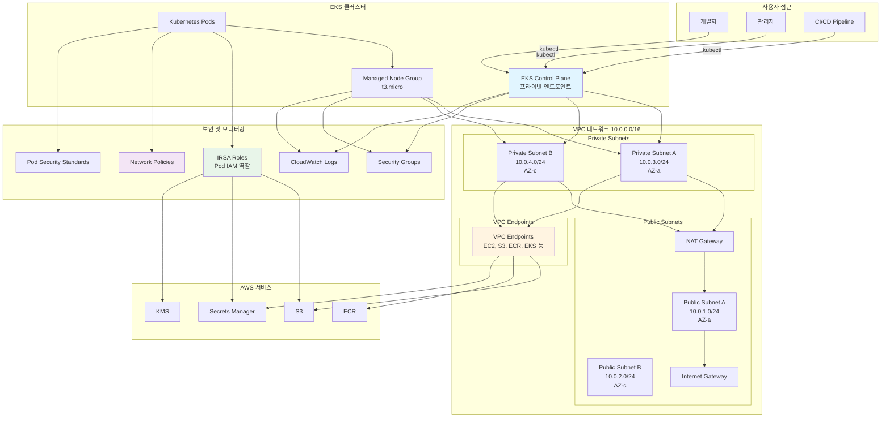
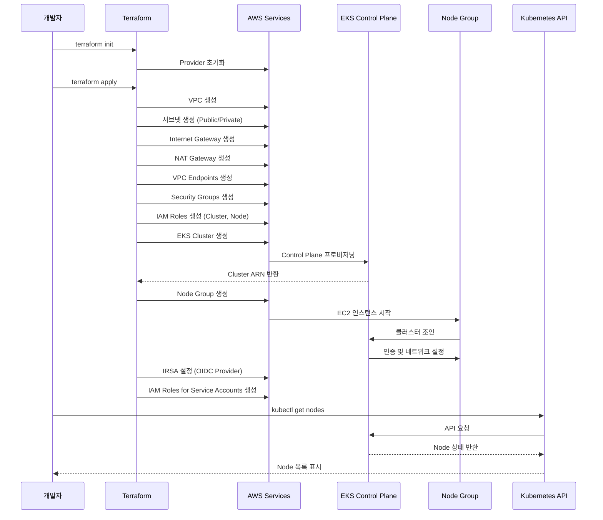
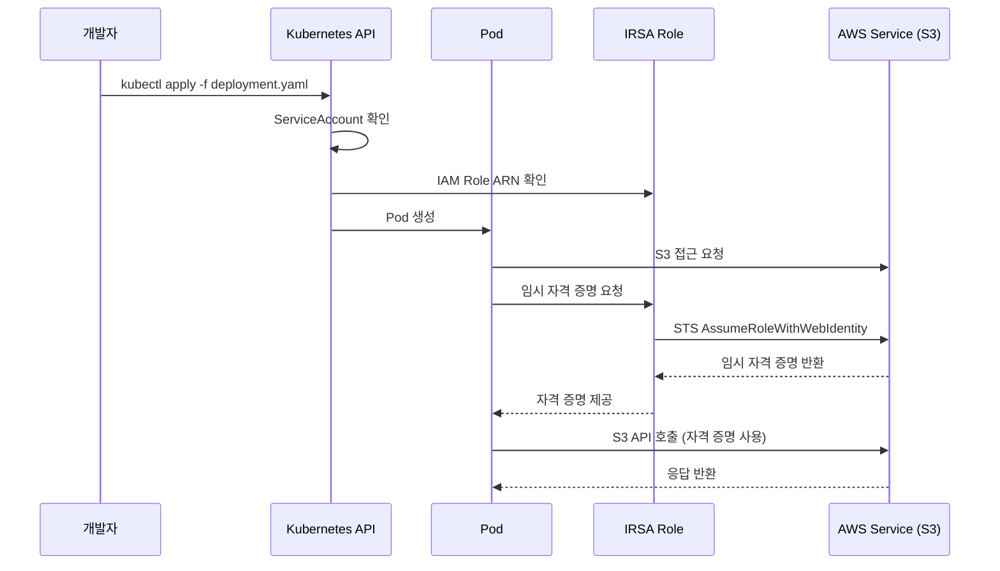
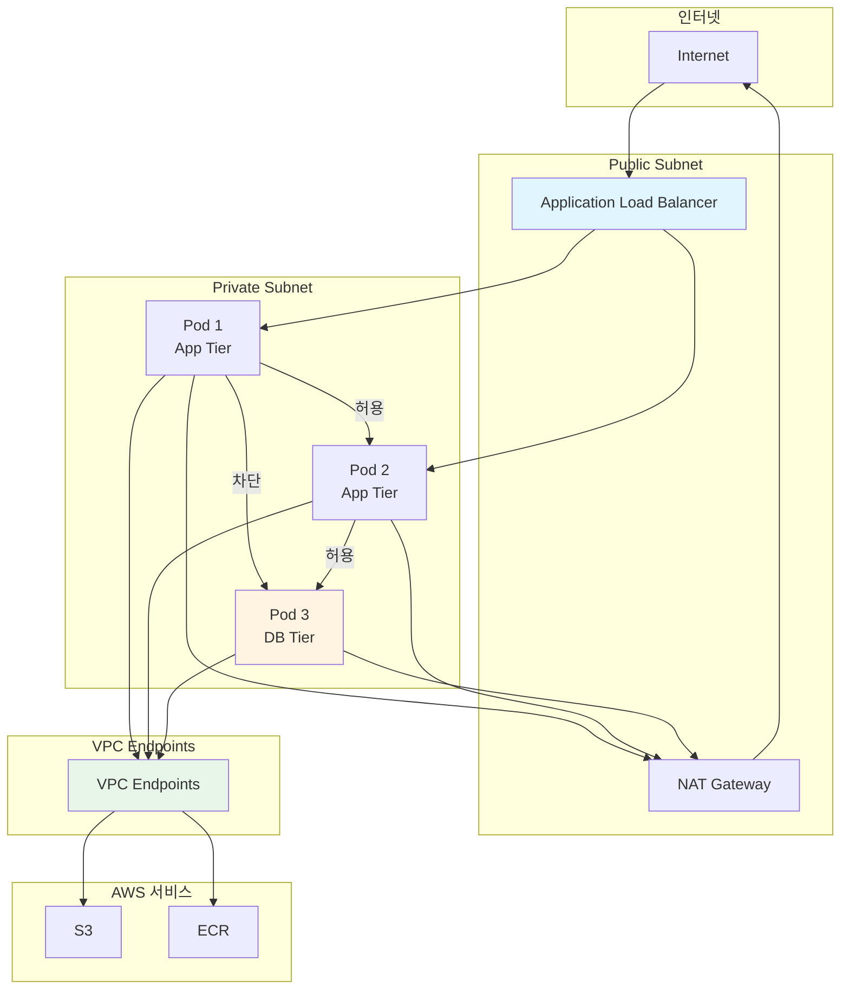

# Amazon EKS (Elastic Kubernetes Service)

> Kubernetes 클러스터를 AWS에서 안전하고 효율적으로 운영하기 위한 Terraform 구성

이 프로젝트는 Terraform을 사용하여 Amazon EKS 클러스터를 프로비저닝하고 관리합니다. 보안 모범 사례를 적용하여 프라이빗 네트워크 환경에서 Kubernetes 워크로드를 실행합니다.

## 📋 목차

- [개요](#개요)
- [EKS 아키텍처](#eks-아키텍처)
- [주요 기능](#주요-기능)
- [사전 요구 사항](#사전-요구-사항)
- [배포 방법](#배포-방법)
- [보안 고려사항](#보안-고려사항)
- [강의 연계](#강의-연계)

## 🎯 개요

Amazon EKS는 관리형 Kubernetes 서비스로, 컨테이너화된 애플리케이션을 안전하고 확장 가능하게 실행할 수 있습니다. 이 프로젝트는 다음과 같은 기능을 제공합니다:

- **프라이빗 클러스터**: Control Plane을 프라이빗 네트워크에서만 접근 가능하도록 구성
- **VPC Endpoints**: AWS 서비스 접근을 위한 VPC Endpoints 구성
- **IRSA (IAM Roles for Service Accounts)**: Pod 레벨에서 AWS 서비스 접근 제어
- **Network Policies**: Pod 간 네트워크 트래픽 제어
- **Pod Security**: Pod 보안 정책 적용

## 🏗️ EKS 아키텍처

### 전체 클러스터 아키텍처



### 클러스터 생성 및 배포 흐름



### Pod 배포 및 IRSA 흐름



### 네트워크 트래픽 흐름



## 🚀 주요 기능

### 1. 프라이빗 클러스터 구성

- Control Plane 엔드포인트를 프라이빗으로 설정
- VPC 내부에서만 접근 가능
- 보안 그룹을 통한 세밀한 접근 제어

### 2. VPC Endpoints

- S3, ECR, EKS 등 AWS 서비스에 대한 프라이빗 연결
- 인터넷 게이트웨이를 통하지 않는 안전한 통신
- 데이터 전송 비용 절감

### 3. IRSA (IAM Roles for Service Accounts)

- Pod 레벨에서 AWS 서비스 접근 제어
- 장기 자격 증명 불필요
- 최소 권한 원칙 적용

### 4. 네트워크 보안

- Network Policies를 통한 Pod 간 통신 제어
- Security Groups를 통한 노드 레벨 보안
- VPC Flow Logs를 통한 네트워크 모니터링

### 5. Pod Security

- Pod Security Standards 적용
- 컨테이너 보안 강화
- 권한 상승 방지

## 📋 사전 요구 사항

- Terraform >= 1.0
- AWS CLI 구성 완료
- kubectl 설치
- 적절한 IAM 권한

## 🚀 배포 방법

### 1. Terraform 초기화

```bash
cd EKS
terraform init
```

### 2. 변수 설정

`terraform.tfvars` 파일을 생성하고 필요한 변수를 설정합니다:

```hcl
cluster_name    = "devsecops-eks"
cluster_version = "1.28"
region          = "ap-northeast-2"
```

### 3. 배포

```bash
terraform plan
terraform apply
```

### 4. kubectl 설정

```bash
aws eks update-kubeconfig --name devsecops-eks --region ap-northeast-2
kubectl get nodes
```

## 🔒 보안 고려사항

### 1. 네트워크 격리

- Public/Private 서브넷 분리
- NAT Gateway를 통한 아웃바운드 트래픽 제어
- VPC Endpoints를 통한 AWS 서비스 접근

### 2. 접근 제어

- Control Plane을 프라이빗으로 설정
- Security Groups를 통한 세밀한 접근 제어
- IRSA를 통한 Pod 레벨 권한 관리

### 3. 암호화

- EKS Secrets 암호화 (KMS)
- Pod 간 통신 암호화
- 저장 데이터 암호화

### 4. 모니터링

- CloudWatch Logs를 통한 클러스터 로깅
- VPC Flow Logs를 통한 네트워크 모니터링
- CloudTrail을 통한 API 호출 감사

## 📚 강의 연계

이 EKS 프로젝트는 [Twodragon의 클라우드 시큐리티 강의](https://twodragon.tistory.com/category/*%20Twodragon/보안%20강의%20%28Course%29)에서 다룹니다:

- **2주차**: AWS 보안 아키텍처 - 컨테이너 보안
- **3주차**: FinOps & ISMS-P - Kubernetes 비용 최적화

### 실습 가이드

1. **클러스터 생성**: Terraform을 사용한 EKS 클러스터 배포
2. **IRSA 설정**: Pod에서 AWS 서비스 접근 설정
3. **Network Policies**: Pod 간 통신 제어 설정
4. **모니터링 설정**: CloudWatch 및 로깅 구성

## 📖 참고 자료

- [AWS EKS 공식 문서](https://docs.aws.amazon.com/eks/)
- [EKS 보안 모범 사례](https://aws.github.io/aws-eks-best-practices/)
- [IRSA 문서](https://docs.aws.amazon.com/eks/latest/userguide/iam-roles-for-service-accounts.html)

## ⚠️ 주의사항

- Control Plane은 프라이빗으로 설정되어 있어 VPC 내부에서만 접근 가능
- VPC Endpoints 비용 고려
- Node Group 인스턴스 타입 및 크기 조정 필요

---

## 📝 관련 블로그 포스트

이 프로젝트와 관련된 블로그 포스트를 참고하세요:

- [Karpenter v1.5.3 노드 통합으로 인한 대규모 장애 분석 및 해결기](https://twodragon.tistory.com/695)
- [DevOps에서 오토스케일링까지: Karpenter와 KEDA의 실전 활용법](https://twodragon.tistory.com/690)
- [클라우드 시큐리티 과정 7기 - 8주차 CI/CD와 Kubernetes 보안 실전 가이드](https://twodragon.tistory.com/689)
- [Kubernetes Minikube & K9s 실습 가이드: 문제 해결부터 실전 테스트까지](https://twodragon.tistory.com/687)
- [클라우드 시큐리티 과정 7기 - 7주차 Docker 및 Kubernetes 이해](https://twodragon.tistory.com/686)

더 많은 블로그 포스트는 [Twodragon 블로그](https://twodragon.tistory.com)에서 확인하실 수 있습니다.

---

**작성자**: [Twodragon](https://twodragon.tistory.com)  
**강의 블로그**: [클라우드 시큐리티 강의](https://twodragon.tistory.com/category/*%20Twodragon/보안%20강의%20%28Course%29)  
**마지막 업데이트**: 2025-01-27

