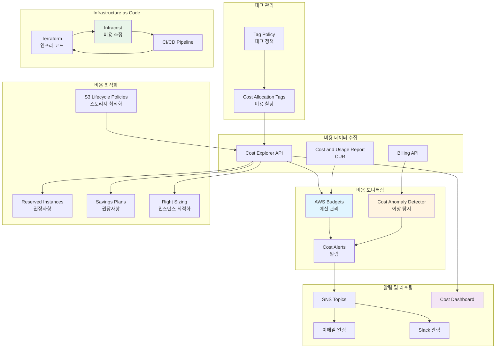
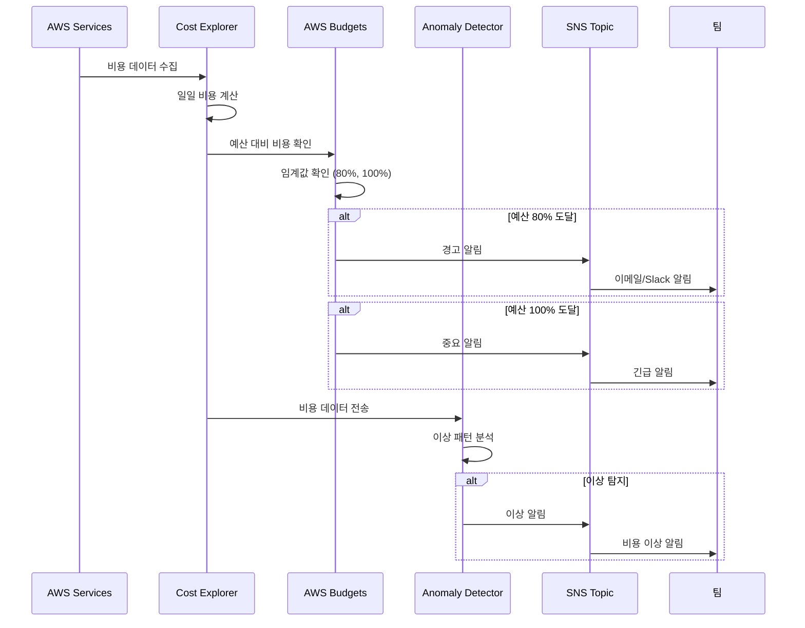
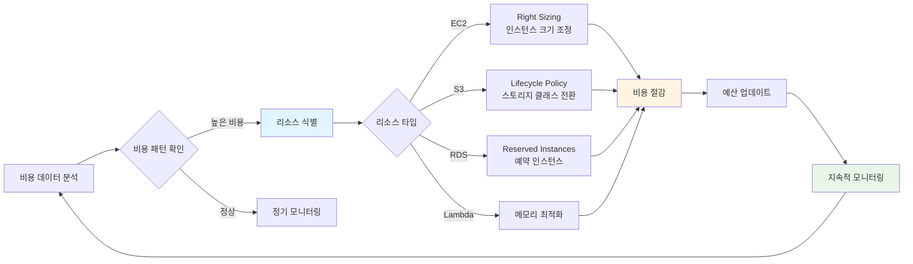

# FinOps 비용 최적화 및 모니터링

이 디렉토리는 **DevSecOps**, **FinOps**, **DevOps** 관점에서 AWS 비용을 최적화하고 모니터링하는 Terraform 모듈과 예시를 제공합니다.

## 📋 개요

FinOps(Financial Operations)는 클라우드 비용을 관리하고 최적화하는 실무 방법론입니다. 이 디렉토리는 다음과 같은 기능을 제공합니다:

- ✅ **비용 예산 관리**: AWS Budgets를 통한 예산 설정 및 알림
- ✅ **비용 이상 탐지**: Cost Explorer Anomaly Detection
- ✅ **스토리지 최적화**: S3 Lifecycle Policy 자동화
- ✅ **비용 할당 태그**: Cost Allocation Tags를 통한 비용 추적
- ✅ **Cost and Usage Report**: 상세한 비용 분석
- ✅ **Infracost 통합**: Infrastructure as Code 비용 추정

## 🏗️ FinOps 아키텍처

### 비용 관리 및 최적화 아키텍처



### 비용 모니터링 및 알림 흐름



### 비용 최적화 프로세스



## 🏗️ 구조

```
FinOps/
├── README.md                    # 이 파일
└── examples/                    # Terraform 예시 모듈
    ├── README.md                # 상세 사용 가이드
    ├── cost-optimization.tf     # 비용 최적화 메인 모듈
    ├── variables.tf              # 변수 정의
    ├── outputs.tf               # 출력값 정의
    ├── terraform.tfvars.example # 변수 예시 파일
    └── infracost-config.yml     # Infracost 설정 파일
```

## 🚀 빠른 시작

### 1. 사전 요구 사항

- Terraform >= 1.0
- AWS CLI 구성 완료
- 적절한 IAM 권한

### 2. 설정

```bash
cd FinOps/examples

# 변수 파일 복사 및 수정
cp terraform.tfvars.example terraform.tfvars
# terraform.tfvars 파일을 실제 값으로 수정
```

### 3. 배포

```bash
# Terraform 초기화
terraform init

# 계획 확인
terraform plan

# 적용
terraform apply
```

## 💰 주요 기능

### 비용 예산 관리

월별 예산을 설정하고 80%, 100% 임계값에서 자동 알림을 받을 수 있습니다.

```hcl
resource "aws_budgets_budget" "monthly" {
  name              = "devsecops-monthly-budget"
  budget_type       = "COST"
  limit_amount      = "5000"
  limit_unit        = "USD"
  time_unit         = "MONTHLY"
  # ... 알림 설정
}
```

### 비용 이상 탐지

비정상적인 비용 증가를 자동으로 탐지하고 알림을 받을 수 있습니다.

```hcl
resource "aws_ce_anomaly_detector" "main" {
  name              = "devsecops-anomaly-detector"
  monitor_type      = "DIMENSIONAL"
  monitor_dimension = "SERVICE"
}
```

### 스토리지 최적화

S3 Lifecycle Policy를 통해 자동으로 스토리지 클래스를 전환하여 비용을 절감합니다.

- 30일 후: Standard → Standard-IA
- 90일 후: Standard-IA → Glacier
- 180일 후: Glacier → Deep Archive (선택사항)

### Infracost 통합

Infrastructure as Code의 비용을 추정하고 CI/CD 파이프라인에 통합할 수 있습니다.

```bash
# 로컬에서 실행
infracost breakdown --path .

# GitHub Actions에서 자동 실행
# .github/workflows/infracost.yml
```

## 📊 FinOps 모범 사례

### 1. 태깅 전략

모든 리소스에 다음 태그를 적용하세요:

- `Environment`: production, staging, development
- `Project`: 프로젝트 이름
- `Team`: 팀 이름
- `CostCenter`: 비용 센터
- `ManagedBy`: Terraform

### 2. 예산 설정

- 월별 예산의 80% 도달 시 경고 알림
- 100% 도달 시 중요 알림
- 예측 비용 기반 알림 설정

### 3. 비용 이상 탐지

- 서비스별 이상 탐지 활성화
- 임계값 설정 (예: $100 이상)
- 자동 알림 구성

### 4. 정기적인 검토

- 주간 비용 리포트 검토
- 사용하지 않는 리소스 식별
- Savings Plans 및 Reserved Instances 권장사항 확인

## 🔒 DevSecOps 보안 고려사항

1. **민감한 정보 보호**
   - `terraform.tfvars`는 `.gitignore`에 포함
   - AWS Secrets Manager 또는 SSM Parameter Store 사용

2. **최소 권한 원칙**
   - 필요한 최소한의 IAM 권한만 부여
   - 리소스별 세분화된 권한 설정

3. **모니터링 및 감사**
   - CloudTrail을 통한 모든 API 호출 로깅
   - Cost Anomaly Detection을 통한 비정상 비용 탐지

## 🛠️ DevOps 자동화

### GitHub Actions 워크플로우

이 모듈은 다음 GitHub Actions 워크플로우와 통합됩니다:

- `infracost.yml`: PR 생성 시 비용 분석
- `infracost-schedule.yml`: 주간 비용 리포트

### 알림 설정

- **이메일 알림**: Budget 알림을 이메일로 수신
- **SNS 알림**: Lambda 함수와 통합하여 Slack, PagerDuty 등으로 알림 전송 가능

## 📚 참고 자료

### AWS 문서

- [AWS Budgets 문서](https://docs.aws.amazon.com/cost-management/latest/userguide/budgets-managing-costs.html)
- [Cost Explorer Anomaly Detection](https://docs.aws.amazon.com/cost-management/latest/userguide/ce-anomaly-detection.html)
- [Cost Allocation Tags](https://docs.aws.amazon.com/cost-management/latest/userguide/cost-alloc-tags.html)

### 외부 자료

- [Infracost 문서](https://www.infracost.io/docs/)
- [FinOps Foundation](https://www.finops.org/)
- [AWS Well-Architected Framework - Cost Optimization Pillar](https://docs.aws.amazon.com/wellarchitected/latest/cost-optimization-pillar/welcome.html)

## 📖 예시 사용법

자세한 사용법은 [`examples/README.md`](./examples/README.md)를 참조하세요.

## ⚠️ 주의사항

- **비용 발생**: 이 모듈 자체는 무료이지만, 모니터링되는 AWS 리소스는 비용이 발생합니다
- **예산 한도**: `monthly_budget_limit`을 적절히 설정하세요
- **알림 설정**: 이메일 주소를 올바르게 설정하지 않으면 알림을 받을 수 없습니다

## 🤝 기여

이 모듈을 개선하거나 버그를 발견하셨다면 Pull Request를 환영합니다!

---

## 📝 관련 블로그 포스트

이 프로젝트와 관련된 블로그 포스트를 참고하세요:

- [클라우드 시큐리티 8기 3주차: AWS FinOps 아키텍처부터 ISMS-P 보안 감사까지 완벽 공략!](https://twodragon.tistory.com/703)
- [클라우드 시큐리티 과정 7기 - 3주차 AWS 보안 및 Finops](https://twodragon.tistory.com/679)

더 많은 블로그 포스트는 [Twodragon 블로그](https://twodragon.tistory.com)에서 확인하실 수 있습니다.

---

**마지막 업데이트**: 2025-01-27
