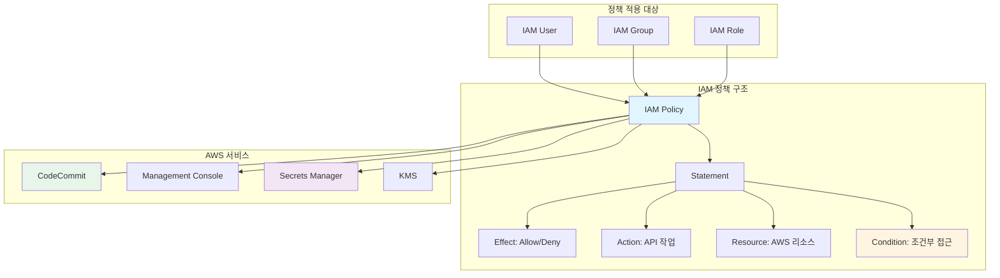
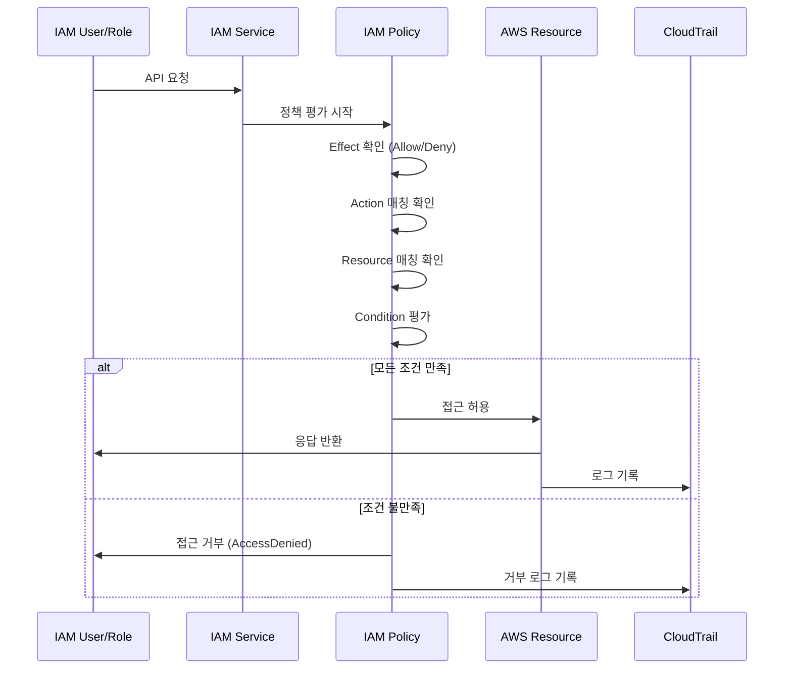
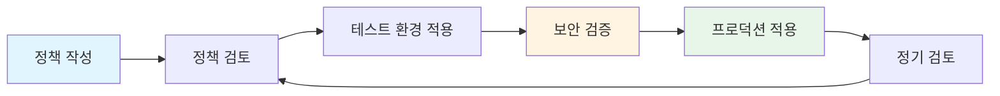

# AWS IAM Policy

> AWS Identity and Access Management (IAM) 정책 모음 및 보안 가이드

이 디렉토리는 다양한 AWS 서비스와 리소스에 대한 IAM 정책 샘플을 제공합니다. 각 정책은 특정 사용 사례에 맞게 설계되었으며, 보안 모범 사례를 따릅니다.

## 📋 목차

- [개요](#개요)
- [IAM 정책 아키텍처](#iam-정책-아키텍처)
- [정책 목록](#정책-목록)
- [사용 방법](#사용-방법)
- [보안 모범 사례](#보안-모범-사례)
- [강의 연계](#강의-연계)

## 🎯 개요

IAM 정책은 AWS 리소스에 대한 접근을 제어하는 핵심 메커니즘입니다. 이 디렉토리에는 다음과 같은 정책들이 포함되어 있습니다:

- **CodeCommit 읽기 전용 정책**: VPC 엔드포인트를 통한 CodeCommit 접근
- **콘솔 MFA 및 IP 제한 정책**: Management Console 접근 보안 강화
- **Secrets Manager 및 KMS 태그 기반 정책**: 리소스 태그를 활용한 세밀한 접근 제어

## 🏗️ IAM 정책 아키텍처

### IAM 정책 구조 및 흐름



### IAM 정책 평가 흐름



### Python 코드로 본 IAM 정책 구조

```python
"""
IAM 정책 구조 및 평가 로직
"""
from typing import Dict, List, Optional
from enum import Enum

class Effect(Enum):
    """정책 효과"""
    ALLOW = "Allow"
    DENY = "Deny"

class IAMPolicy:
    """IAM 정책 클래스"""
    
    def __init__(self, version: str = "2012-10-17"):
        self.version = version
        self.statements: List[Dict] = []
    
    def add_statement(
        self,
        effect: Effect,
        actions: List[str],
        resources: List[str],
        conditions: Optional[Dict] = None,
        sid: Optional[str] = None
    ):
        """정책 Statement 추가"""
        statement = {
            "Effect": effect.value,
            "Action": actions,
            "Resource": resources
        }
        
        if sid:
            statement["Sid"] = sid
        
        if conditions:
            statement["Condition"] = conditions
        
        self.statements.append(statement)
        return self
    
    def evaluate_access(
        self,
        action: str,
        resource: str,
        context: Dict
    ) -> bool:
        """접근 권한 평가"""
        for statement in self.statements:
            # Effect 확인
            if statement["Effect"] == "Deny":
                if self._matches_statement(statement, action, resource, context):
                    return False  # Deny는 즉시 거부
            
            # Allow 확인
            if statement["Effect"] == "Allow":
                if self._matches_statement(statement, action, resource, context):
                    return True  # Allow는 허용
        
        return False  # 기본값: 거부
    
    def _matches_statement(
        self,
        statement: Dict,
        action: str,
        resource: str,
        context: Dict
    ) -> bool:
        """Statement 매칭 확인"""
        # Action 매칭
        actions = statement.get("Action", [])
        if not self._matches_pattern(action, actions):
            return False
        
        # Resource 매칭
        resources = statement.get("Resource", [])
        if not self._matches_pattern(resource, resources):
            return False
        
        # Condition 평가
        conditions = statement.get("Condition", {})
        if conditions and not self._evaluate_conditions(conditions, context):
            return False
        
        return True
    
    def _matches_pattern(self, value: str, patterns: List[str]) -> bool:
        """와일드카드 패턴 매칭"""
        import fnmatch
        return any(fnmatch.fnmatch(value, pattern) for pattern in patterns)
    
    def _evaluate_conditions(self, conditions: Dict, context: Dict) -> bool:
        """조건 평가"""
        for operator, condition in conditions.items():
            for key, values in condition.items():
                context_value = context.get(key)
                if not self._check_condition(operator, context_value, values):
                    return False
        return True
    
    def _check_condition(self, operator: str, value: any, expected: any) -> bool:
        """조건 연산자 평가"""
        operators = {
            "StringEquals": lambda v, e: v == e,
            "StringLike": lambda v, e: self._matches_pattern(str(v), [str(e)]),
            "IpAddress": lambda v, e: self._check_ip_range(v, e),
            "BoolIfExists": lambda v, e: v == e if v is not None else True
        }
        
        if operator in operators:
            if isinstance(expected, list):
                return any(operators[operator](value, exp) for exp in expected)
            return operators[operator](value, expected)
        
        return False
    
    def to_json(self) -> Dict:
        """JSON 형식으로 변환"""
        return {
            "Version": self.version,
            "Statement": self.statements
        }

# 사용 예제
if __name__ == "__main__":
    # CodeCommit 읽기 전용 정책 생성
    codecommit_policy = IAMPolicy()
    codecommit_policy.add_statement(
        effect=Effect.ALLOW,
        actions=[
            "codecommit:BatchGet*",
            "codecommit:Get*",
            "codecommit:Describe*",
            "codecommit:List*",
            "codecommit:GitPull"
        ],
        resources=["*"],
        conditions={
            "StringEquals": {
                "aws:sourceVpce": "vpce-*"
            }
        }
    )
    
    print(codecommit_policy.to_json())
```

## 📝 정책 목록

### 1. CodeCommit 읽기 전용 정책

**파일**: `CodeCommitReadOnly.json`

**설명**: AWS CodeCommit 리포지토리에 대한 읽기 전용 접근 권한을 제공합니다. VPC 엔드포인트를 통한 접근만 허용하여 보안을 강화합니다.

**주요 권한**:
- CodeCommit Git Pull 작업
- CodeCommit 리소스 조회 및 나열
- CloudWatch Events 규칙 읽기
- SNS 구독 정보 조회
- Lambda 함수 목록 조회
- IAM 사용자 정보 조회

**보안 특징**:
- VPC 엔드포인트(`vpce-*`)에서만 접근 허용
- 읽기 전용 권한만 제공 (쓰기 작업 차단)

### 2. 콘솔 MFA 및 IP 제한 정책

**파일**: `Console_MFA_IP.json`

**설명**: AWS Management Console 접근 시 MFA(Multi-Factor Authentication) 및 IP 주소 제한을 적용합니다.

**주요 기능**:
- IAM 사용자 계정 관리
- 비밀번호 변경
- 로그인 프로필 생성
- MFA 디바이스 관리

**보안 특징**:
- MFA 필수
- IP 주소 기반 접근 제어
- 콘솔 접근 보안 강화

### 3. Secrets Manager 및 KMS 태그 기반 정책

**파일**: `SecretsManager-KMS-Tag.json`

**설명**: 리소스 태그를 기반으로 AWS Secrets Manager 및 KMS 접근을 제어합니다.

**주요 기능**:
- 태그 기반 조건부 접근
- Secrets Manager 시크릿 접근
- KMS 키 관리

**보안 특징**:
- 리소스 태그를 활용한 세밀한 접근 제어
- 최소 권한 원칙 적용

## 🚀 사용 방법

### 1. 정책 파일 확인

```bash
# 정책 파일 목록 확인
ls -la IAM/*.json

# 정책 내용 확인
cat IAM/CodeCommitReadOnly.json | jq .
```

### 2. IAM 정책 생성

#### AWS CLI 사용

```bash
# 정책 생성
aws iam create-policy \
  --policy-name CodeCommitReadOnlyPolicy \
  --policy-document file://IAM/CodeCommitReadOnly.json \
  --description "CodeCommit read-only access policy"
```

#### Terraform 사용

```hcl
resource "aws_iam_policy" "codecommit_readonly" {
  name        = "CodeCommitReadOnlyPolicy"
  description = "CodeCommit read-only access policy"
  policy      = file("${path.module}/IAM/CodeCommitReadOnly.json")
}
```

### 3. 정책 연결

```bash
# 사용자에 정책 연결
aws iam attach-user-policy \
  --user-name codecommit-readonly-user \
  --policy-arn arn:aws:iam::ACCOUNT_ID:policy/CodeCommitReadOnlyPolicy

# 그룹에 정책 연결
aws iam attach-group-policy \
  --group-name codecommit-readonly-group \
  --policy-arn arn:aws:iam::ACCOUNT_ID:policy/CodeCommitReadOnlyPolicy

# 역할에 정책 연결
aws iam attach-role-policy \
  --role-name codecommit-readonly-role \
  --policy-arn arn:aws:iam::ACCOUNT_ID:policy/CodeCommitReadOnlyPolicy
```

## 🔒 보안 모범 사례

### 1. 최소 권한 원칙

- 필요한 최소한의 권한만 부여
- 정기적인 권한 검토 및 정리
- 사용하지 않는 정책 제거

### 2. 조건부 접근 제어

- IP 주소 기반 접근 제어
- 시간 기반 접근 제어
- MFA 필수 설정

### 3. 정책 검토



### 4. 모니터링 및 감사

- CloudTrail을 통한 IAM 활동 로깅
- 정기적인 접근 권한 감사
- 비정상적인 접근 패턴 탐지

## 📚 강의 연계

이 IAM 정책들은 [Twodragon의 클라우드 시큐리티 강의](https://twodragon.tistory.com/category/*%20Twodragon/보안%20강의%20%28Course%29) **2주차: AWS 보안 아키텍처**에서 다룹니다.

### 강의 내용

- IAM 정책 작성 및 구조 이해
- 최소 권한 원칙 적용
- 조건부 접근 제어 구현
- MFA 및 IP 제한 설정
- 태그 기반 접근 제어

### 실습 가이드

1. **정책 작성 실습**: 각 정책 파일을 분석하고 커스터마이징
2. **정책 적용 실습**: AWS CLI 또는 Terraform을 사용한 정책 배포
3. **보안 검증 실습**: 정책 효과 검증 및 모니터링

## 📖 참고 자료

- [AWS IAM 공식 문서](https://docs.aws.amazon.com/IAM/latest/UserGuide/introduction.html)
- [IAM 정책 모범 사례](https://docs.aws.amazon.com/IAM/latest/UserGuide/best-practices.html)
- [IAM 정책 언어 참조](https://docs.aws.amazon.com/IAM/latest/UserGuide/reference_policies.html)

## ⚠️ 주의사항

- 정책을 프로덕션 환경에 적용하기 전에 테스트 환경에서 충분히 검증하세요.
- 정기적으로 정책을 검토하고 불필요한 권한을 제거하세요.
- 민감한 리소스에 대한 접근은 추가적인 보안 계층을 고려하세요.

---

**작성자**: [Twodragon](https://twodragon.tistory.com)  
**강의 블로그**: [클라우드 시큐리티 강의](https://twodragon.tistory.com/category/*%20Twodragon/보안%20강의%20%28Course%29)  
**마지막 업데이트**: 2025-01-27
