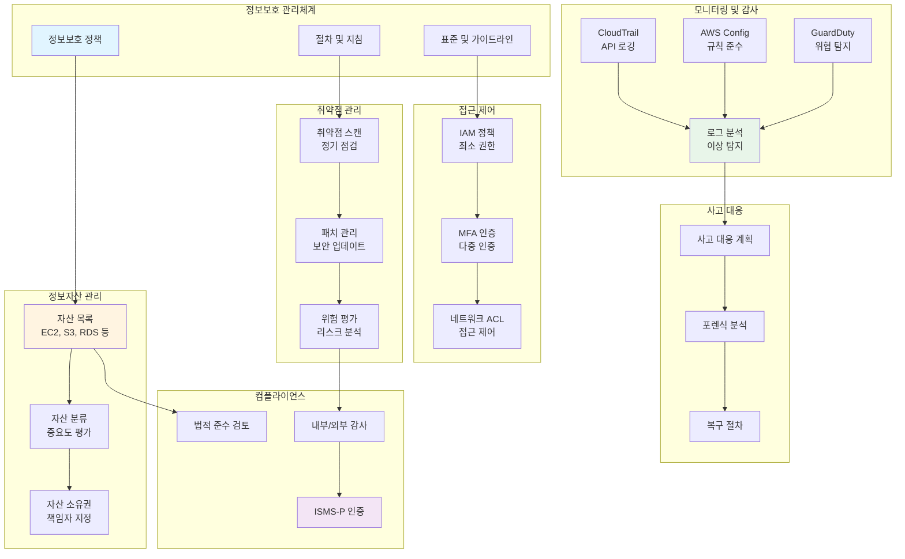
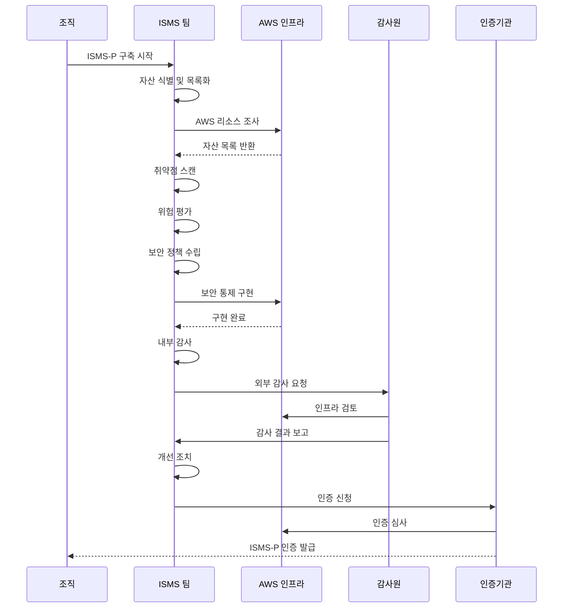
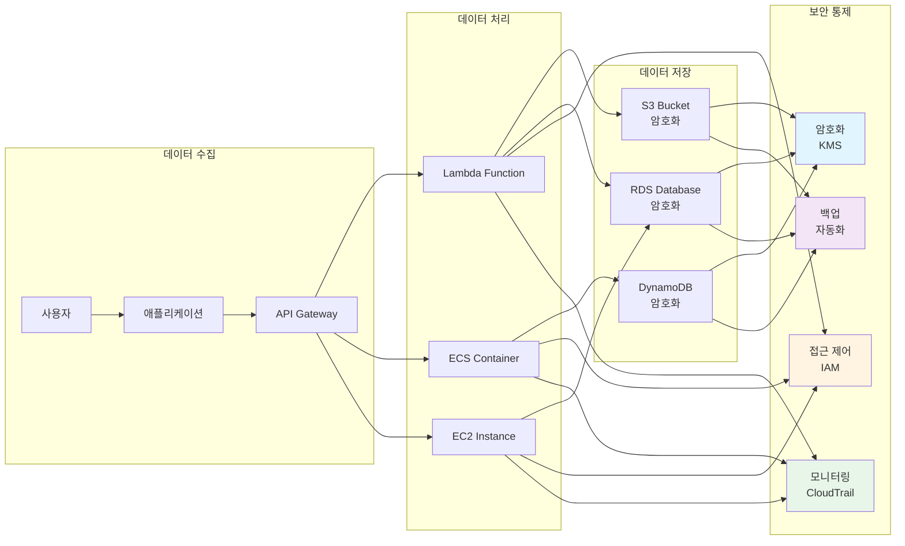

# ISMS-P 구축 및 인증 가이드

## 개요

이 문서는 **정보보호 관리체계(ISMS)** 및 **개인정보보호 관리체계(PIMS)**를 통합한 **ISMS-P**를 구축하고 인증받기 위한 절차와 방법을 안내하는 자료입니다. **ISMS-P**는 정보보호와 개인정보보호를 통합적으로 관리할 수 있는 체계로, 기업의 정보보호 역량을 향상시키고 개인정보의 안전한 처리를 보장합니다.

## 프로젝트 목적

ISMS-P 인증을 통해 조직은 정보자산의 보안성을 강화하고, 개인정보의 안전한 처리를 보장함으로써 각종 법적, 규제적 요구사항을 준수하게 됩니다. 이 가이드는 ISMS-P 인증을 위한 체계 구축부터 운영 및 유지관리 방안을 다룹니다.

## 🏗️ ISMS-P 아키텍처

### ISMS-P 관리 체계 구조



### ISMS-P 구축 프로세스



### 정보 흐름 및 보안 통제



## ISMS-P 인증 신청 유형

### 자율신청자

**자율신청자**는 법적으로 ISMS 인증 의무 대상자에 해당하지 않지만, 자발적으로 정보보호 및 개인정보보호 관리체계를 구축·운영하고자 하는 기업 및 기관을 의미합니다. 자율신청자는 ISMS-P 인증을 희망할 경우 자율적으로 인증심사를 신청할 수 있습니다.

### ISMS 인증 의무대상자

**ISMS 인증 의무대상자**는 「정보통신망 이용촉진 및 정보보호 등에 관한 법률」 제47조 2항에 따라 일정 기준을 충족하는 기업 및 기관입니다. 아래는 의무대상자 기준을 요약한 내용입니다:

- **ISP(인터넷 서비스 제공자)**: 「전기통신사업법」 제6조제1항에 따라 허가를 받은 자로서 서울특별시 및 모든 광역시에서 정보통신망서비스를 제공하는 자
- **IDC(인터넷 데이터 센터)**: 「정보통신망법」 제46조에 따른 집적정보통신시설 사업자
- **의무대상자 기준**: 다음 조건 중 하나라도 해당하는 자
  - 연간 매출액 또는 세입이 1,500억원 이상인 자
  - 상급종합병원(「의료법」 제3조의4)
  - 재학생 수가 1만 명 이상인 학교(「고등교육법」 제2조)
  - 정보통신서비스 부문 전년도 매출액이 100억원 이상인 자
  - 전년도 일일평균 정보통신서비스 이용자 수가 100만 명 이상인 자

## 프로젝트 범위

- **대상 조직**: 정보자산과 개인정보를 취급하는 모든 기업 및 기관
- **적용 영역**:
  - 서버, 네트워크, 데이터베이스, 클라우드 환경
  - 개인정보 처리 흐름 및 정보 보호 관리체계

## ISMS-P 구축 절차

### 1. 자산 식별 및 관리
   - **정보자산 식별**: 서버, 데이터베이스, 네트워크 장비, 클라우드 계정 등의 자산을 식별하고 관리합니다.
   - **자산 중요도 평가**: 기밀성, 무결성, 가용성(CIA)을 기준으로 각 자산의 중요도를 평가합니다.
   - **자산 목록 유지**: 자산 위치, 상태, 보안 조치 현황을 기록하고 주기적으로 업데이트합니다.

### 2. 취약점 관리
   - **취약점 스캐닝**: 서버, 네트워크 장비, 데이터베이스의 보안 취약점을 주기적으로 점검하고 개선합니다.
   - **클라우드 보안 감사**: AWS, Azure 등의 클라우드 계정에 대한 주기적인 보안 감사 및 모니터링을 수행합니다.

### 3. 법적 준거성 확보
   - **법적 요구사항 준수**: 정보통신망법, 개인정보 보호법 등 관련 법률을 준수합니다.
   - **법적 점검 결과 기록**: 법적 요구사항을 충족하는지 여부를 점검하고 이를 문서화합니다.

### 4. 정보 흐름 분석
   - **정보 흐름도 작성**: 조직 내에서 정보가 어떻게 처리되고 이동하는지 시각적으로 표현하여 보안 리스크를 식별합니다.
   - **개인정보 흐름도 작성**: 개인정보가 수집, 처리, 저장되는 경로를 파악하고 보호 조치를 적용합니다.

### 5. 위험 평가 및 대응
   - **위험 평가**: 잠재적인 보안 위협을 식별하고, 그 발생 가능성과 영향을 평가합니다.
   - **위험 완화 계획**: 고위험 영역에 대한 대응 계획을 수립하고, 위험을 최소화할 수 있는 방안을 마련합니다.

### 6. 보안 정책 및 절차 개발
   - **보안 정책 수립**: 정보보호 정책, 개인정보 처리 방침, 접근 제어 및 사고 대응 계획을 수립하고 주기적으로 검토합니다.
   - **지침 및 매뉴얼 개발**: 직원들이 이해할 수 있도록 사용 지침과 매뉴얼을 작성하고 배포합니다.

### 7. 보안 교육 및 인식 강화
   - **보안 교육 프로그램**: 정보보호와 개인정보보호에 관한 교육을 전 직원에게 정기적으로 실시합니다.
   - **지속적 교육**: 새로운 보안 위협과 규제 변화에 대해 지속적으로 교육합니다.

## 주요 산출물
- **위험 평가 보고서**: 식별된 취약점과 위험 요소, 그리고 이에 대한 대응 방안을 기록한 보고서.
- **자산 목록**: 모든 정보자산의 목록과 보호 조치 현황.
- **정보 흐름도**: 데이터 및 개인정보의 흐름을 시각화한 도면.
- **법적 준수 체크리스트**: 관련 법률과 규정을 충족했는지 점검한 내용.
- **사고 대응 계획**: 정보 유출이나 보안 사고 발생 시 대응 절차.

## 인증 절차

1. **초기 검토 및 감사**: 내부적으로 정책, 자산, 취약점을 검토합니다.
2. **갭 분석**: 현재 상태와 ISMS-P 요구사항 간의 격차를 분석합니다.
3. **통제 조치 구현**: 발견된 격차를 해결하기 위한 보안 통제 조치를 적용합니다.
4. **인증 심사**: 외부 심사원에 의해 ISMS-P 인증 심사를 받습니다.
5. **지속적인 모니터링**: 주기적으로 보안 체계를 점검하고 새로운 취약점에 대해 대응합니다.

## AWS 자산 수집 스크립트 사용법

이 디렉토리에는 ISMS-P 인증을 위한 AWS 자산 정보를 자동으로 수집하는 Python 스크립트들이 포함되어 있습니다.

### 사전 요구 사항

1. **Python 3.9 이상**
2. **AWS 자격 증명 설정**
   - AWS CLI 설정 (`aws configure`)
   - 또는 환경 변수 (`AWS_ACCESS_KEY_ID`, `AWS_SECRET_ACCESS_KEY`)
   - 또는 IAM 역할 (EC2/Lambda에서 실행 시)

3. **의존성 설치**
   ```bash
   pip install -r requirements.txt
   ```

### 환경 변수 설정

스크립트 실행 전 다음 환경 변수를 설정할 수 있습니다:

```bash
# AWS 설정
export AWS_REGION=ap-northeast-2
export AWS_PROFILE=your-profile-name  # 선택적

# 출력 설정
export ISMS_OUTPUT_DIR=./output
export ISMS_OUTPUT_FORMAT=csv  # csv, xlsx, json

# 로깅 설정
export ISMS_LOG_LEVEL=INFO  # DEBUG, INFO, WARNING, ERROR
export ISMS_LOG_FILE=./logs/isms.log  # 선택적

# Google Drive 설정 (ec2_s3_drive.py용, 선택적)
export GOOGLE_SERVICE_ACCOUNT_FILE=/path/to/service-account.json
```

### 사용 가능한 스크립트

#### 1. `aws_info.py` - 전체 AWS 자산 정보 수집

모든 AWS 서비스의 자산 정보를 Excel 파일로 수집합니다.

```bash
python aws_info.py
```

**수집 항목:**
- EC2 인스턴스
- S3 버킷
- ECR 리포지토리
- IAM 역할 및 정책
- Route 53 호스티드 존 및 레코드
- RDS 인스턴스
- CloudFront 배포
- Lambda 함수

**출력:** `aws_assets_isms_p_YYYYMMDD_HHMMSS.xlsx`

#### 2. `ec2_info.py` - EC2 인스턴스 정보 수집

```bash
python ec2_info.py
```

**출력:** `ec2_info_YYYYMMDD_HHMMSS.csv`

#### 3. `s3_info.py` - S3 버킷 정보 수집

```bash
python s3_info.py
```

**출력:** `s3_buckets_info_YYYYMMDD_HHMMSS.csv`

#### 4. `s3_script.py` - S3 버킷 보안 설정 점검

S3 버킷의 보안 설정을 상세히 점검합니다.

```bash
python s3_script.py
```

**점검 항목:**
- 버킷 암호화
- 버킷 로깅
- ACL 설정
- 버킷 정책
- 퍼블릭 액세스 차단
- 암호화 규칙

**출력:** `s3_bucket_info_YYYYMMDD_HHMMSS.csv`

#### 5. `Lambda_info.py` - Lambda 함수 정보 수집

```bash
python Lambda_info.py
```

**출력:** `aws_lambda_inventory_YYYYMMDD_HHMMSS.csv`

#### 6. `route53_info.py` - Route 53 레코드 정보 수집

```bash
python route53_info.py
```

**출력:** `route53_records_YYYYMMDD_HHMMSS.csv`

#### 7. `ec2_eni.py` - EC2 네트워크 인터페이스 정보 수집

```bash
python ec2_eni.py
```

**출력:** `instance_details_YYYYMMDD_HHMMSS.csv`

#### 8. `eks_info.py` - EKS 클러스터 노드 정보 수집

**주의:** Kubernetes 클러스터 접근 권한이 필요합니다.

```bash
# Kubernetes 클라이언트 설치
pip install kubernetes

# kubeconfig 설정
export KUBECONFIG=~/.kube/config

python eks_info.py
```

**출력:** `eks_nodes_info_YYYYMMDD_HHMMSS.csv`

#### 9. `ec2_s3_drive.py` - Google Drive 업로드

EC2 및 S3 정보를 수집하여 Google Drive에 업로드합니다.

```bash
# Google Drive API 라이브러리 설치
pip install gspread oauth2client

# 서비스 계정 파일 설정
export GOOGLE_SERVICE_ACCOUNT_FILE=/path/to/service-account.json

python ec2_s3_drive.py
```

**출력:**
- 로컬: `aws_assets_isms_p_YYYYMMDD_HHMMSS.xlsx`
- Google Drive: 자동 생성된 스프레드시트

### 스크립트 구조

```
ISMS/
├── utils/              # 공통 유틸리티 모듈
│   ├── __init__.py
│   ├── aws_clients.py  # AWS 클라이언트 관리
│   ├── config.py       # 설정 관리
│   ├── logger.py       # 로깅 유틸리티
│   ├── exporters.py    # 데이터 내보내기
│   └── exceptions.py   # 커스텀 예외
├── aws_info.py         # 전체 자산 수집
├── ec2_info.py         # EC2 정보 수집
├── s3_info.py          # S3 정보 수집
├── s3_script.py        # S3 보안 점검
├── Lambda_info.py      # Lambda 정보 수집
├── route53_info.py     # Route 53 정보 수집
├── ec2_eni.py          # EC2 ENI 정보 수집
├── eks_info.py         # EKS 정보 수집
├── ec2_s3_drive.py     # Google Drive 업로드
├── requirements.txt    # 의존성 목록
└── README.md           # 이 파일
```

## 보안 가이드

### 자격 증명 관리

1. **절대 하드코딩 금지**
   - AWS 자격 증명을 코드에 직접 작성하지 마세요
   - 환경 변수 또는 AWS IAM 역할 사용

2. **최소 권한 원칙**
   - 스크립트 실행에 필요한 최소한의 권한만 부여
   - 필요한 권한:
     - `ec2:DescribeInstances`
     - `s3:ListBuckets`, `s3:GetBucket*`
     - `iam:ListRoles`, `iam:GetRolePolicy`, `iam:GetPolicy`
     - `route53:ListHostedZones`, `route53:ListResourceRecordSets`
     - `rds:DescribeDBInstances`
     - `cloudfront:ListDistributions`
     - `lambda:ListFunctions`
     - `ecr:DescribeRepositories`

3. **자격 증명 로테이션**
   - 정기적으로 AWS 자격 증명을 로테이션하세요
   - IAM 사용자 대신 역할 사용 권장

### 출력 파일 보안

1. **민감 정보 포함 주의**
   - 수집된 데이터에는 IAM 정책, 버킷 정책 등 민감한 정보가 포함될 수 있습니다
   - 출력 파일을 안전하게 보관하고 접근을 제한하세요

2. **파일 권한 설정**
   ```bash
   chmod 600 output/*.csv
   chmod 600 output/*.xlsx
   ```

3. **저장 위치**
   - 출력 파일을 버전 관리 시스템에 커밋하지 마세요
   - `.gitignore`에 출력 디렉토리 추가:
     ```
     output/
     *.csv
     *.xlsx
     logs/
     ```

### 로깅 보안

1. **로그 파일 보안**
   - 로그 파일에 민감한 정보가 기록되지 않도록 주의
   - 로그 파일 접근 권한 제한

2. **CloudWatch Logs 통합** (선택적)
   - 프로덕션 환경에서는 CloudWatch Logs 사용 권장
   - 로그 암호화 및 보존 정책 설정

### 네트워크 보안

1. **VPC 엔드포인트 사용** (선택적)
   - 인터넷을 통하지 않고 AWS 서비스에 접근
   - VPC 내에서 실행 시 VPC 엔드포인트 구성 권장

2. **프록시 설정** (필요 시)
   - 기업 네트워크에서 실행 시 프록시 설정 가능
   ```bash
   export HTTP_PROXY=http://proxy.example.com:8080
   export HTTPS_PROXY=http://proxy.example.com:8080
   ```

## 문제 해결

### 일반적인 오류

1. **AWS 연결 실패**
   ```
   Error: AWS 연결 실패. 자격 증명을 확인하세요.
   ```
   - 해결: `aws configure` 실행 또는 환경 변수 확인

2. **권한 부족**
   ```
   ClientError: An error occurred (AccessDenied) when calling the DescribeInstances operation
   ```
   - 해결: IAM 정책에서 필요한 권한 추가

3. **모듈 없음**
   ```
   ImportError: No module named 'pandas'
   ```
   - 해결: `pip install -r requirements.txt` 실행

### 디버깅

로깅 레벨을 DEBUG로 설정하여 상세한 정보 확인:

```bash
export ISMS_LOG_LEVEL=DEBUG
python aws_info.py
```

## ISMS-P 2025 Prowler 활용 방안

### Prowler를 활용한 자산 식별 및 위험 관리

ISMS-P 2025 최신 가이드에 따라 Prowler를 활용한 자동화된 자산 식별 및 위험 관리 시스템을 제공합니다.

**주요 기능:**
- AWS 자산 자동 식별 및 중요도 평가 (CIA 기준)
- Prowler 보안 점검 통합
- 위험 등급 자동 부여 및 우선순위 관리
- 위험 관리 대시보드 생성

**사용법:**
```bash
# Prowler 설치
pip install prowler

# 통합 자산 식별 및 위험 평가 실행
cd isms-p-cloud-audit
python prowler_isms_2025.py

# 위험 관리 대시보드 생성
python risk_dashboard.py isms_risk_report_20241201_120000.json
```

**자세한 내용:** [`isms-p-cloud-audit/README.md`](isms-p-cloud-audit/README.md) 참조

### 위험 평가 기준 (ISMS-P 2025)

- **Critical (80점 이상)**: 즉시 조치 필요
  - 보안 정책 위반
  - 암호화 미설정
  - 퍼블릭 액세스 허용

- **High (60-79점)**: 우선 조치 필요
  - 로깅 미설정
  - 버전 관리 미설정
  - 백업 미설정

- **Medium (40-59점)**: 계획적 조치 필요
  - 태그 미설정
  - 모니터링 알림 미설정

- **Low (20-39점)**: 모니터링 필요
  - 최적화 권장 사항

## 자동화

### Cron 작업 설정

정기적으로 자산 정보를 수집하려면 cron 작업을 설정하세요:

```bash
# 매일 오전 9시에 실행
0 9 * * * cd /path/to/ISMS && /usr/bin/python3 aws_info.py >> /var/log/isms.log 2>&1

# 매주 월요일 오전 9시에 위험 평가 실행
0 9 * * 1 cd /path/to/ISMS/isms-p-cloud-audit && /usr/bin/python3 prowler_isms_2025.py >> /var/log/isms_risk.log 2>&1
```

### Lambda 함수로 실행

스크립트를 Lambda 함수로 변환하여 정기적으로 실행할 수 있습니다. `examples/automated-audit.tf`를 참조하세요.

## 결론

**ISMS-P 인증**을 통해 조직은 정보자산의 보안성을 강화하고, 개인정보 보호를 위한 법적 요구사항을 충족할 수 있습니다. 이 문서의 가이드라인을 따름으로써 조직은 정보보호 관리체계를 구축하고 ISMS-P 인증을 효율적으로 준비할 수 있습니다.

이 스크립트들을 사용하여 AWS 자산 정보를 자동으로 수집하고, ISMS-P 인증 준비에 활용하세요.

## 라이선스
이 프로젝트는 MIT 라이선스 하에 제공됩니다.

---

## 📝 관련 블로그 포스트

이 프로젝트와 관련된 블로그 포스트를 참고하세요:

- [클라우드 시큐리티 8기 4주차: 통합 보안 취약점 점검 및 ISMS-P 인증 대응 실무](https://twodragon.tistory.com/705)
- [클라우드 시큐리티 8기 3주차: AWS FinOps 아키텍처부터 ISMS-P 보안 감사까지 완벽 공략!](https://twodragon.tistory.com/703)
- [클라우드 보안 과정 7기 - 4주차 AWS 취약점 점검 및 ISMS 대응 가이드](https://twodragon.tistory.com/682)

더 많은 블로그 포스트는 [Twodragon 블로그](https://twodragon.tistory.com)에서 확인하실 수 있습니다.
