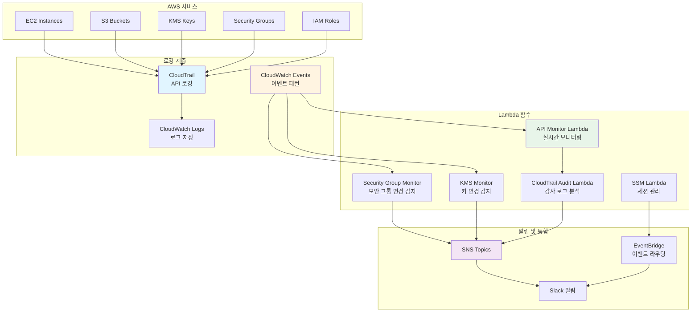
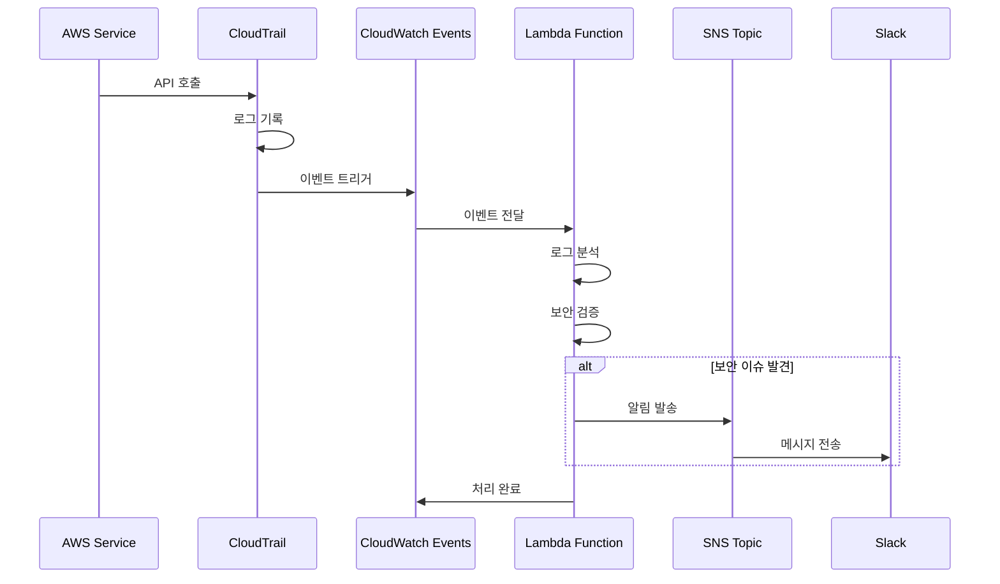
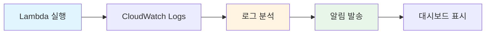

# AWS Lambda Functions

> AWS Lambda 함수를 통한 보안 모니터링 및 자동화

이 디렉토리는 AWS 보안 모니터링 및 자동화를 위한 Lambda 함수들을 포함합니다. CloudTrail 로그 분석, 보안 그룹 모니터링, SSM 관리 등을 자동화합니다.

## 📋 목차

- [개요](#개요)
- [Lambda 아키텍처](#lambda-아키텍처)
- [프로젝트 목록](#프로젝트-목록)
- [사용 방법](#사용-방법)
- [보안 고려사항](#보안-고려사항)
- [강의 연계](#강의-연계)

## 🎯 개요

Lambda 함수는 AWS 인프라의 보안 모니터링과 자동화를 담당합니다. 주요 기능:

- **실시간 API 모니터링**: CloudTrail 로그를 통한 AWS API 활동 감시
- **보안 그룹 변경 감지**: 보안 그룹 설정 변경 실시간 알림
- **KMS 키 모니터링**: KMS 키 생성/삭제 감지
- **SSM 세션 관리**: Systems Manager 세션 모니터링 및 로깅

## 🏗️ Lambda 아키텍처

### 전체 Lambda 모니터링 아키텍처



### Lambda 함수 실행 흐름



### Python 코드로 본 Lambda 구조

```python
"""
Lambda 함수 구조 및 실행 흐름
"""
import json
import boto3
from typing import Dict, List, Optional
from datetime import datetime

class LambdaSecurityMonitor:
    """보안 모니터링 Lambda 함수 기본 클래스"""
    
    def __init__(self):
        self.sns_client = boto3.client('sns')
        self.cloudtrail_client = boto3.client('cloudtrail')
        self.sns_topic_arn = "arn:aws:sns:region:account:security-alerts"
    
    def lambda_handler(self, event: Dict, context: any) -> Dict:
        """Lambda 핸들러 메인 함수"""
        try:
            # 이벤트 파싱
            records = self._parse_event(event)
            
            # 보안 검증
            security_issues = self._analyze_security(records)
            
            # 알림 발송
            if security_issues:
                self._send_alert(security_issues)
            
            return {
                "statusCode": 200,
                "body": json.dumps({
                    "message": "Security monitoring completed",
                    "issues_found": len(security_issues)
                })
            }
        except Exception as e:
            return {
                "statusCode": 500,
                "body": json.dumps({"error": str(e)})
            }
    
    def _parse_event(self, event: Dict) -> List[Dict]:
        """CloudWatch Events 파싱"""
        records = []
        
        if 'Records' in event:
            for record in event['Records']:
                if 'body' in record:
                    body = json.loads(record['body'])
                    records.append(body)
        elif 'detail' in event:
            records.append(event['detail'])
        
        return records
    
    def _analyze_security(self, records: List[Dict]) -> List[Dict]:
        """보안 분석"""
        issues = []
        
        for record in records:
            # 이벤트 타입별 분석
            event_name = record.get('eventName', '')
            
            if self._is_security_group_change(event_name):
                issues.append({
                    "type": "SecurityGroupChange",
                    "event": record,
                    "severity": "HIGH"
                })
            elif self._is_kms_key_change(event_name):
                issues.append({
                    "type": "KMSKeyChange",
                    "event": record,
                    "severity": "CRITICAL"
                })
            elif self._is_iam_policy_change(event_name):
                issues.append({
                    "type": "IAMPolicyChange",
                    "event": record,
                    "severity": "HIGH"
                })
        
        return issues
    
    def _is_security_group_change(self, event_name: str) -> bool:
        """보안 그룹 변경 이벤트 확인"""
        sg_events = [
            "AuthorizeSecurityGroupIngress",
            "AuthorizeSecurityGroupEgress",
            "RevokeSecurityGroupIngress",
            "RevokeSecurityGroupEgress",
            "CreateSecurityGroup",
            "DeleteSecurityGroup"
        ]
        return event_name in sg_events
    
    def _is_kms_key_change(self, event_name: str) -> bool:
        """KMS 키 변경 이벤트 확인"""
        kms_events = [
            "CreateKey",
            "CreateAlias",
            "DisableKey",
            "DeleteAlias",
            "ScheduleKeyDeletion"
        ]
        return event_name in kms_events
    
    def _is_iam_policy_change(self, event_name: str) -> bool:
        """IAM 정책 변경 이벤트 확인"""
        iam_events = [
            "CreatePolicy",
            "DeletePolicy",
            "PutUserPolicy",
            "PutRolePolicy",
            "AttachRolePolicy",
            "DetachRolePolicy"
        ]
        return event_name in iam_events
    
    def _send_alert(self, issues: List[Dict]):
        """SNS를 통한 알림 발송"""
        message = {
            "timestamp": datetime.utcnow().isoformat(),
            "issues": issues,
            "summary": f"Found {len(issues)} security issues"
        }
        
        self.sns_client.publish(
            TopicArn=self.sns_topic_arn,
            Message=json.dumps(message, indent=2),
            Subject="Security Alert: AWS API Monitoring"
        )

class SecurityGroupMonitor(LambdaSecurityMonitor):
    """보안 그룹 모니터링 전용 Lambda"""
    
    def _analyze_security(self, records: List[Dict]) -> List[Dict]:
        """보안 그룹 변경 분석"""
        issues = []
        
        for record in records:
            event_name = record.get('eventName', '')
            
            if self._is_security_group_change(event_name):
                issues.append({
                    "type": "SecurityGroupChange",
                    "event_name": event_name,
                    "user": record.get('userIdentity', {}).get('userName', 'Unknown'),
                    "time": record.get('eventTime', ''),
                    "resources": record.get('resources', []),
                    "severity": "HIGH",
                    "message": f"Security group {event_name} detected"
                })
        
        return issues

class KMSMonitor(LambdaSecurityMonitor):
    """KMS 키 모니터링 전용 Lambda"""
    
    def _analyze_security(self, records: List[Dict]) -> List[Dict]:
        """KMS 키 변경 분석"""
        issues = []
        
        for record in records:
            event_name = record.get('eventName', '')
            
            if self._is_kms_key_change(event_name):
                issues.append({
                    "type": "KMSKeyChange",
                    "event_name": event_name,
                    "user": record.get('userIdentity', {}).get('userName', 'Unknown'),
                    "time": record.get('eventTime', ''),
                    "key_id": record.get('responseElements', {}).get('keyId', 'Unknown'),
                    "severity": "CRITICAL",
                    "message": f"KMS key {event_name} detected"
                })
        
        return issues

# Lambda 핸들러 함수
def lambda_handler(event, context):
    """Lambda 진입점"""
    monitor = SecurityGroupMonitor()
    return monitor.lambda_handler(event, context)
```

## 📝 프로젝트 목록

### 1. AWS API 실시간 모니터링

**위치**: `AWS-API-Monitor/`

**설명**: CloudTrail 로그를 실시간으로 분석하여 보안 이벤트를 감지하고 알림을 발송합니다.

**주요 기능**:
- 보안 그룹 변경 감지
- KMS 키 생성/삭제 감지
- CloudTrail 설정 변경 감지
- 콘솔 로그인 실패 감지
- 권한 오류 감지
- IAM 정책 변경 감지

**Lambda 함수**:
- `cloudtrail_audit_lambda_function.py`: CloudTrail 감사
- `sg_lambda_function.py`: 보안 그룹 모니터링
- `kms_lambda_function.py`: KMS 키 모니터링

**문서**: [AWS-API-Monitor/README.md](./AWS-API-Monitor/README.md)

### 2. Amazon Systems Manager (SSM)

**위치**: `SSM/`

**설명**: SSM Session Manager를 통한 EC2 인스턴스 관리 및 보안 모니터링

**주요 기능**:
- SSM 세션 시작/종료 모니터링
- 세션 로깅 및 감사
- KMS 암호화 지원
- SCP 정책 적용

**Lambda 함수**:
- `lambda_function.py`: SSM 세션 이벤트 처리

**정책 파일**:
- `IAM_policy.json`: SSM 접근을 위한 IAM 정책
- `SCP_Policy.json`: Service Control Policy

**문서**: [SSM/readme.md](./SSM/readme.md)

### 3. AWS Config 통합

**위치**: `Config_lambda_function.py`

**설명**: AWS Config 규칙 위반 시 자동 대응

### 4. GuardDuty 통합

**위치**: `Guardduty_lambda.function.py`

**설명**: GuardDuty 위협 탐지 시 자동 알림 및 대응

## 🚀 사용 방법

### 1. Lambda 함수 배포

```bash
# 의존성 설치
pip install -r requirements.txt -t .

# 패키징
zip -r lambda_function.zip lambda_function.py *.py

# Lambda 함수 생성
aws lambda create-function \
  --function-name security-group-monitor \
  --runtime python3.9 \
  --role arn:aws:iam::ACCOUNT_ID:role/lambda-execution-role \
  --handler lambda_function.lambda_handler \
  --zip-file fileb://lambda_function.zip \
  --timeout 60 \
  --memory-size 256
```

### 2. CloudWatch Events 규칙 설정

```bash
# 보안 그룹 변경 이벤트 규칙 생성
aws events put-rule \
  --name security-group-changes \
  --event-pattern '{
    "source": ["aws.ec2"],
    "detail-type": ["AWS API Call via CloudTrail"],
    "detail": {
      "eventName": [
        "AuthorizeSecurityGroupIngress",
        "AuthorizeSecurityGroupEgress",
        "RevokeSecurityGroupIngress",
        "RevokeSecurityGroupEgress"
      ]
    }
  }'

# Lambda 함수에 규칙 연결
aws events put-targets \
  --rule security-group-changes \
  --targets "Id"="1","Arn"="arn:aws:lambda:region:account:function:security-group-monitor"
```

### 3. Terraform을 사용한 배포

```hcl
resource "aws_lambda_function" "security_monitor" {
  filename         = "lambda_function.zip"
  function_name    = "security-group-monitor"
  role            = aws_iam_role.lambda_role.arn
  handler         = "lambda_function.lambda_handler"
  runtime         = "python3.9"
  timeout         = 60
  memory_size     = 256

  environment {
    variables = {
      SNS_TOPIC_ARN = aws_sns_topic.security_alerts.arn
    }
  }
}

resource "aws_cloudwatch_event_rule" "sg_changes" {
  name        = "security-group-changes"
  description = "Capture Security Group changes"

  event_pattern = jsonencode({
    source      = ["aws.ec2"]
    detail-type = ["AWS API Call via CloudTrail"]
    detail = {
      eventName = [
        "AuthorizeSecurityGroupIngress",
        "AuthorizeSecurityGroupEgress"
      ]
    }
  })
}

resource "aws_cloudwatch_event_target" "lambda" {
  rule      = aws_cloudwatch_event_rule.sg_changes.name
  target_id = "SendToLambda"
  arn       = aws_lambda_function.security_monitor.arn
}
```

## 🔒 보안 고려사항

### 1. IAM 역할 최소 권한

```json
{
  "Version": "2012-10-17",
  "Statement": [
    {
      "Effect": "Allow",
      "Action": [
        "logs:CreateLogGroup",
        "logs:CreateLogStream",
        "logs:PutLogEvents",
        "sns:Publish"
      ],
      "Resource": "*"
    }
  ]
}
```

### 2. 환경 변수 암호화

- KMS를 사용한 환경 변수 암호화
- Secrets Manager를 통한 시크릿 관리

### 3. VPC 설정

- 프라이빗 리소스 접근을 위한 VPC 설정
- 보안 그룹 및 네트워크 ACL 구성

### 4. 모니터링 및 로깅



## 📚 강의 연계

이 Lambda 함수들은 [Twodragon의 클라우드 시큐리티 강의](https://twodragon.tistory.com/category/*%20Twodragon/보안%20강의%20%28Course%29)에서 다룹니다:

- **2주차**: AWS 보안 아키텍처 - Lambda 보안 모니터링
- **4주차**: 통합 보안 점검 - 자동화 스크립트

### 실습 가이드

1. **Lambda 함수 작성**: 보안 모니터링 함수 개발
2. **이벤트 규칙 설정**: CloudWatch Events 규칙 구성
3. **알림 연동**: SNS 및 Slack 연동
4. **모니터링 설정**: CloudWatch 대시보드 구성

## 📖 참고 자료

- [AWS Lambda 공식 문서](https://docs.aws.amazon.com/lambda/)
- [CloudWatch Events 문서](https://docs.aws.amazon.com/AmazonCloudWatch/latest/events/)
- [Lambda 보안 모범 사례](https://docs.aws.amazon.com/lambda/latest/dg/security-best-practices.html)

## ⚠️ 주의사항

- Lambda 함수 실행 시간 및 메모리 제한 고려
- CloudWatch Logs 비용 모니터링
- 이벤트 규칙의 이벤트 패턴 정확성 확인
- SNS 토픽 권한 설정 확인

## 📝 관련 블로그 포스트

이 프로젝트와 관련된 블로그 포스트를 참고하세요:

- [NPM "Shai-Hulud" 자가 복제 웜 공격: 180개 이상 패키지 침해된 대규모 공급망 공격 완전 분석](https://twodragon.tistory.com/694)
- [[긴급] npm 생태계 대규모 보안 침해: 20억 다운로드 패키지 악성코드 감염](https://twodragon.tistory.com/692)
- [Amazon Q Developer와 GitHub Advanced Security를 활용한 코드 보안 강화 및 AWS 최적화](https://twodragon.tistory.com/685)
- [클라우드 시큐리티 과정 7기 - 6주차 Cloudflare 및 github 보안](https://twodragon.tistory.com/684)

더 많은 블로그 포스트는 [Twodragon 블로그](https://twodragon.tistory.com)에서 확인하실 수 있습니다.

---

**작성자**: [Twodragon](https://twodragon.tistory.com)  
**강의 블로그**: [클라우드 시큐리티 강의](https://twodragon.tistory.com/category/*%20Twodragon/보안%20강의%20%28Course%29)  
**마지막 업데이트**: 2025-01-27
