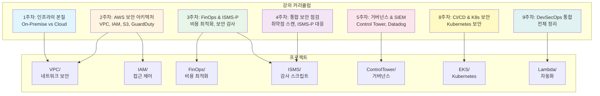

# AWS DevSecOps Infrastructure

> 클라우드 보안 전문가를 위한 실무형 DevSecOps 인프라 자동화 저장소

[](https://twodragon.tistory.com/category/*%20Twodragon/보안%20강의%20%28Course%29)
[](https://www.terraform.io/)
[](https://aws.amazon.com/cdk/)
[](https://www.python.org/)

이 저장소는 [Twodragon의 클라우드 시큐리티 강의](https://twodragon.tistory.com/category/*%20Twodragon/보안%20강의%20%28Course%29)와 연계된 실무형 DevSecOps 인프라 자동화 프로젝트 모음입니다.

## 📋 목차

- [개요](#개요)
- [강의 커리큘럼 연계](#강의-커리큘럼-연계)
- [아키텍처 개요](#아키텍처-개요)
- [프로젝트 구조](#프로젝트-구조)
- [빠른 시작](#빠른-시작)
- [주요 프로젝트](#주요-프로젝트)
- [보안](#보안)
- [참고 자료](#참고-자료)

## 🎯 개요

이 저장소는 Terraform과 AWS CDK를 사용하여 AWS 인프라를 자동화하고 관리하는 멀티 프로젝트 저장소입니다. 클라우드 보안 강의와 연계하여 실무에서 바로 활용 가능한 보안 인프라를 제공합니다.

### 주요 기술 스택

- **Terraform**: 인프라 프로비저닝 및 관리
- **AWS CDK**: TypeScript 기반 클라우드 인프라 정의
- **Python**: Lambda 함수 및 자동화 스크립트
- **GitHub Actions**: CI/CD 및 보안 스캔 자동화

## 📚 강의 커리큘럼 연계

이 저장소는 [Twodragon의 클라우드 시큐리티 강의](https://twodragon.tistory.com/category/*%20Twodragon/보안%20강의%20%28Course%29)와 연계되어 있습니다.

### 강의 주차별 프로젝트 매핑



### 강의 주차별 상세 내용

| 주차 | 강의 주제 | 관련 프로젝트 | 블로그 링크 |
|------|----------|-------------|-----------|
| 1주차 | 인프라의 본질 (On-Premise vs Cloud) | `VPC/`, `EC2/` | [강의 링크](https://twodragon.tistory.com) |
| 2주차 | AWS 보안 아키텍처 (VPC, IAM, S3, GuardDuty) | `VPC/`, `IAM/`, `Lambda/AWS-API-Monitor/` | [강의 링크](https://twodragon.tistory.com) |
| 3주차 | FinOps & ISMS-P (비용 최적화, 보안 감사) | `FinOps/`, `ISMS/` | [강의 링크](https://twodragon.tistory.com) |
| 4주차 | 통합 보안 점검 (취약점 스캔, ISMS-P 대응) | `ISMS/`, `Lambda/AWS-API-Monitor/` | [강의 링크](https://twodragon.tistory.com) |
| 5주차 | 거버넌스 & SIEM (Control Tower, Datadog) | `ControlTower/` | [강의 링크](https://twodragon.tistory.com) |
| 8주차 | CI/CD & Kubernetes 보안 | `EKS/` | [강의 링크](https://twodragon.tistory.com) |
| 9주차 | DevSecOps 통합 정리 | 전체 프로젝트 | [강의 링크](https://twodragon.tistory.com) |

## 🏗️ 아키텍처 개요

### 전체 시스템 아키텍처

```mermaid
graph TB
    subgraph "개발 환경"
        Dev[개발자]
        Git[GitHub Repository]
    end
    
    subgraph "CI/CD 파이프라인"
        Actions[GitHub Actions]
        Security[보안 스캔<br/>CodeQL, TFSec, Checkov]
    end
    
    subgraph "인프라 프로비저닝"
        Terraform[Terraform<br/>EC2, EKS, VPC]
        CDK[AWS CDK<br/>Bedrock, Calculator]
    end
    
    subgraph "AWS 서비스"
        EC2[EC2 Instances]
        Lambda[Lambda Functions]
        EKS[EKS Cluster]
        Bedrock[Bedrock KB]
        S3[S3 Buckets]
        CloudFront[CloudFront]
    end
    
    subgraph "모니터링 및 보안"
        CloudWatch[CloudWatch]
        GuardDuty[GuardDuty]
        CloudTrail[CloudTrail]
        ControlTower[Control Tower]
    end
    
    Dev --> Git
    Git --> Actions
    Actions --> Security
    Security --> Terraform
    Security --> CDK
    Terraform --> EC2
    Terraform --> EKS
    Terraform --> Lambda
    CDK --> Bedrock
    CDK --> CloudFront
    EC2 --> CloudWatch
    Lambda --> CloudWatch
    EKS --> CloudWatch
    EC2 --> GuardDuty
    Lambda --> CloudTrail
    ControlTower --> EC2
    ControlTower --> Lambda
    
    style Dev fill:#4A154B
    style Terraform fill:#7B42BC
    style CDK fill:#FF9900
    style Bedrock fill:#232F3E
    style Security fill:#FF6B6B
```



### DevSecOps 프로세스 흐름

```python
"""
DevSecOps 프로세스 흐름도
"""
class DevSecOpsProcess:
    """DevSecOps 전체 프로세스를 관리하는 클래스"""
    
    def __init__(self):
        self.stages = {
            "1. 개발": {
                "활동": ["코드 작성", "커밋", "PR 생성"],
                "도구": ["Git", "IDE"],
                "출력": "코드 변경사항"
            },
            "2. CI/CD": {
                "활동": ["자동화 빌드", "테스트", "보안 스캔"],
                "도구": ["GitHub Actions", "CodeQL", "TFSec"],
                "출력": "검증된 코드"
            },
            "3. 보안 스캔": {
                "활동": ["정적 분석", "인프라 검사", "취약점 스캔"],
                "도구": ["CodeQL", "TFSec", "Checkov", "Trivy"],
                "출력": "보안 리포트"
            },
            "4. 배포": {
                "활동": ["인프라 프로비저닝", "애플리케이션 배포"],
                "도구": ["Terraform", "AWS CDK"],
                "출력": "운영 환경"
            },
            "5. 모니터링": {
                "활동": ["로그 수집", "위협 탐지", "알림"],
                "도구": ["CloudWatch", "GuardDuty", "CloudTrail"],
                "출력": "보안 이벤트"
            },
            "6. 강의": {
                "활동": ["실습 환경 제공", "예제 코드", "문서화"],
                "도구": ["이 저장소", "블로그"],
                "출력": "학습 자료"
            }
        }
    
    def get_process_flow(self):
        """프로세스 흐름 반환"""
        return {
            "개발": "코드 작성 및 커밋",
            "CI/CD": "GitHub Actions로 자동화",
            "보안 스캔": "CodeQL, TFSec, Checkov",
            "배포": "Terraform/CDK로 인프라 프로비저닝",
            "모니터링": "CloudWatch, GuardDuty, CloudTrail",
            "강의": "DevSecOps 강의 자료 제공"
        }
```

## 📁 프로젝트 구조

```
aws-devsecops-infrastructure/
├── IAM/                              # IAM 정책 및 보안 설정
│   ├── CodeCommitReadOnly.json      # CodeCommit 읽기 전용 정책
│   ├── Console_MFA_IP.json         # 콘솔 MFA 및 IP 제한 정책
│   ├── SecretsManager-KMS-Tag.json  # Secrets Manager 및 KMS 정책
│   └── README.md
├── VPC/                              # VPC 및 네트워크 보안
│   ├── okta-ip-plist.py            # Okta IP 범위 관리
│   ├── okta-ip-sg.py               # 보안 그룹 자동화
│   └── README.md
├── EC2/                              # EC2 인프라 및 모니터링
│   ├── terraform/                   # Terraform 인프라 코드
│   ├── scripts/                     # 자동화 스크립트
│   └── README.md
├── EKS/                              # Kubernetes 클러스터 보안
│   ├── k8s/                         # Kubernetes 리소스
│   ├── modules/                     # Terraform 모듈
│   └── README.md
├── Lambda/                           # Lambda 함수 보안 모니터링
│   ├── AWS-API-Monitor/            # API 모니터링 함수
│   ├── SSM/                         # SSM 관리 함수
│   └── README.md
├── ControlTower/                     # AWS Control Tower 거버넌스
│   ├── aws/audit/                   # 감사 설정
│   └── README.md
├── Cloudfront/                       # CloudFront 및 S3 CDN 보안
│   └── s3-cloudfront-cdn/
├── ISMS/                             # ISMS-P 인증 대응 스크립트
│   ├── aws_info.py                 # AWS 자산 정보 수집
│   ├── ec2_info.py                 # EC2 정보 수집
│   └── README.md
├── FinOps/                           # 비용 최적화 및 FinOps
│   └── README.md
├── Bedrock/                          # Amazon Bedrock AI 보안
│   └── README.md
└── docs/                             # 문서 및 강의 자료
    └── courses/                     # 강의별 실습 가이드
```

각 프로젝트의 상세한 설명은 해당 디렉토리의 README 파일을 참조하세요.

## 🚀 빠른 시작

### 사전 요구 사항

```bash
# 필수 도구 설치 확인
terraform version    # >= 1.0
aws --version        # >= 2.0
python3 --version   # >= 3.9
node --version       # >= 20
```

### 1. 저장소 클론

```bash
git clone https://github.com/your-org/aws-devsecops-infrastructure.git
cd aws-devsecops-infrastructure
```

### 2. Terraform 프로젝트 작업

```bash
# 특정 Terraform 프로젝트로 이동
cd EC2/terraform

# 초기화
terraform init

# 계획 확인
terraform plan

# 적용 (주의: 실제 리소스 생성)
terraform apply
```

### 3. CDK 프로젝트 작업

```bash
# Bedrock 프로젝트 예시
cd Bedrock

# 의존성 설치
npm install

# 빌드
npm run build

# 테스트
npm test

# CDK 합성 (배포 전 확인)
cdk synth

# 배포 (주의: 실제 리소스 생성)
cdk deploy
```

### 4. Lambda 함수 배포

```bash
# Lambda 함수 디렉토리로 이동
cd Lambda/AWS-API-Monitor

# 의존성 설치
pip install -r requirements.txt

# 패키징
zip -r lambda_function.zip lambda_function.py

# 배포 (AWS CLI 사용)
aws lambda create-function \
  --function-name aws-api-monitor \
  --runtime python3.9 \
  --role arn:aws:iam::account-id:role/lambda-role \
  --handler lambda_function.lambda_handler \
  --zip-file fileb://lambda_function.zip
```

자세한 내용은 [AGENTS.md](./AGENTS.md) 파일을 참조하세요.

## 🏗️ 주요 프로젝트

### IAM 보안
- **위치**: `IAM/`
- **설명**: AWS IAM 정책 및 보안 설정
- **강의 연계**: 2주차 (AWS 보안 아키텍처)
- **문서**: [IAM/README.md](./IAM/README.md)

### VPC 네트워크 보안
- **위치**: `VPC/`
- **설명**: VPC, 서브넷, 보안 그룹 관리
- **강의 연계**: 1주차, 2주차
- **문서**: [VPC/README.md](./VPC/README.md)

### EC2 인프라
- **위치**: `EC2/terraform/`
- **설명**: EC2 인스턴스 및 Lambda 모니터링
- **강의 연계**: 1주차, 2주차
- **문서**: [EC2/README.md](./EC2/README.md)

### EKS Kubernetes 보안
- **위치**: `EKS/`
- **설명**: Kubernetes 클러스터 보안 설정
- **강의 연계**: 8주차 (CI/CD & Kubernetes 보안)
- **문서**: [EKS/README.md](./EKS/) (참고)

### Lambda 보안 모니터링
- **위치**: `Lambda/`
- **설명**: AWS API 모니터링 및 보안 감사
- **강의 연계**: 2주차, 4주차
- **문서**: [Lambda/README.md](./Lambda/README.md)

### Control Tower 거버넌스
- **위치**: `ControlTower/`
- **설명**: AWS Control Tower 및 SCP 설정
- **강의 연계**: 5주차 (거버넌스 & SIEM)
- **문서**: [ControlTower/README.md](./ControlTower/README.md)

### ISMS-P 인증 대응
- **위치**: `ISMS/`
- **설명**: ISMS-P 인증을 위한 자동화 스크립트
- **강의 연계**: 3주차, 4주차
- **문서**: [ISMS/README.md](./ISMS/README.md)

### FinOps 비용 최적화
- **위치**: `FinOps/`
- **설명**: AWS 비용 최적화 및 FinOps 아키텍처
- **강의 연계**: 3주차
- **문서**: [FinOps/README.md](./FinOps/README.md)

## 🔒 보안

이 저장소는 여러 보안 스캔 도구를 사용하여 코드 품질과 보안을 자동으로 검사합니다:

- **CodeQL**: 코드 보안 분석
- **TFSec**: Terraform 보안 검사
- **Checkov**: 인프라 보안 검사
- **Trivy**: 취약점 스캔
- **Secret Scanning**: 시크릿 검사

### 보안 가이드라인

- ⚠️ **절대 커밋하지 말 것**: `.tfstate` 파일, `.tfvars` 파일, API 키, 비밀번호
- ✅ **사용 권장**: AWS Secrets Manager, SSM Parameter Store, 환경 변수
- 📖 자세한 내용: [.github/SECRET_SCANNING.md](./.github/SECRET_SCANNING.md)

## 📚 참고 자료

### 강의 자료
- [클라우드 시큐리티 강의 블로그](https://twodragon.tistory.com/category/*%20Twodragon/보안%20강의%20%28Course%29) - 실무형 클라우드 보안 강의
- [강의 자료 인덱스](./docs/COURSES_INDEX.md) - 강의별 실습 가이드

### 프로젝트 문서
- [AGENTS.md](./AGENTS.md) - AI 코딩 에이전트 가이드
- [REPOSITORY_MIGRATION_SUMMARY.md](./REPOSITORY_MIGRATION_SUMMARY.md) - 저장소 통합 내역
- [SECURITY.md](./SECURITY.md) - 보안 가이드라인

### 외부 문서
- [AWS 공식 문서](https://docs.aws.amazon.com/)
- [Terraform 문서](https://www.terraform.io/docs)
- [AWS CDK 문서](https://docs.aws.amazon.com/cdk/)

## 🤝 기여 가이드

### 브랜치 전략

- `main` 또는 `master` 브랜치에 직접 푸시하지 않음
- 기능 브랜치에서 작업 후 Pull Request 생성
- PR 제목 형식: `[프로젝트명] 제목` (예: `[EC2] Lambda 함수 업데이트`)

### 커밋 전 체크리스트

```bash
# Terraform 프로젝트
terraform fmt
terraform validate

# CDK 프로젝트
npm run build
npm test

# Python 프로젝트
python -m py_compile *.py
```

## ⚠️ 주의사항

- **실제 AWS 리소스 생성/변경**: `terraform apply` 및 `cdk deploy` 실행 시 주의
- **비용**: 리소스 생성 시 AWS 비용 발생 가능
- **보안**: 시크릿 및 자격 증명은 절대 커밋하지 않음
- **백엔드 상태**: Terraform 상태 파일은 S3에 저장되며, 동시 작업 시 충돌 주의

## 📝 라이선스

각 프로젝트는 개별 라이선스를 가질 수 있습니다. 프로젝트별 LICENSE 파일을 확인하세요.

## 📞 문의

프로젝트 관련 문의사항은 Issues를 통해 제출해주세요.

---

**작성자**: [Twodragon](https://twodragon.tistory.com)  
**강의 블로그**: [클라우드 시큐리티 강의](https://twodragon.tistory.com/category/*%20Twodragon/보안%20강의%20%28Course%29)  
**마지막 업데이트**: 2025-01-27
