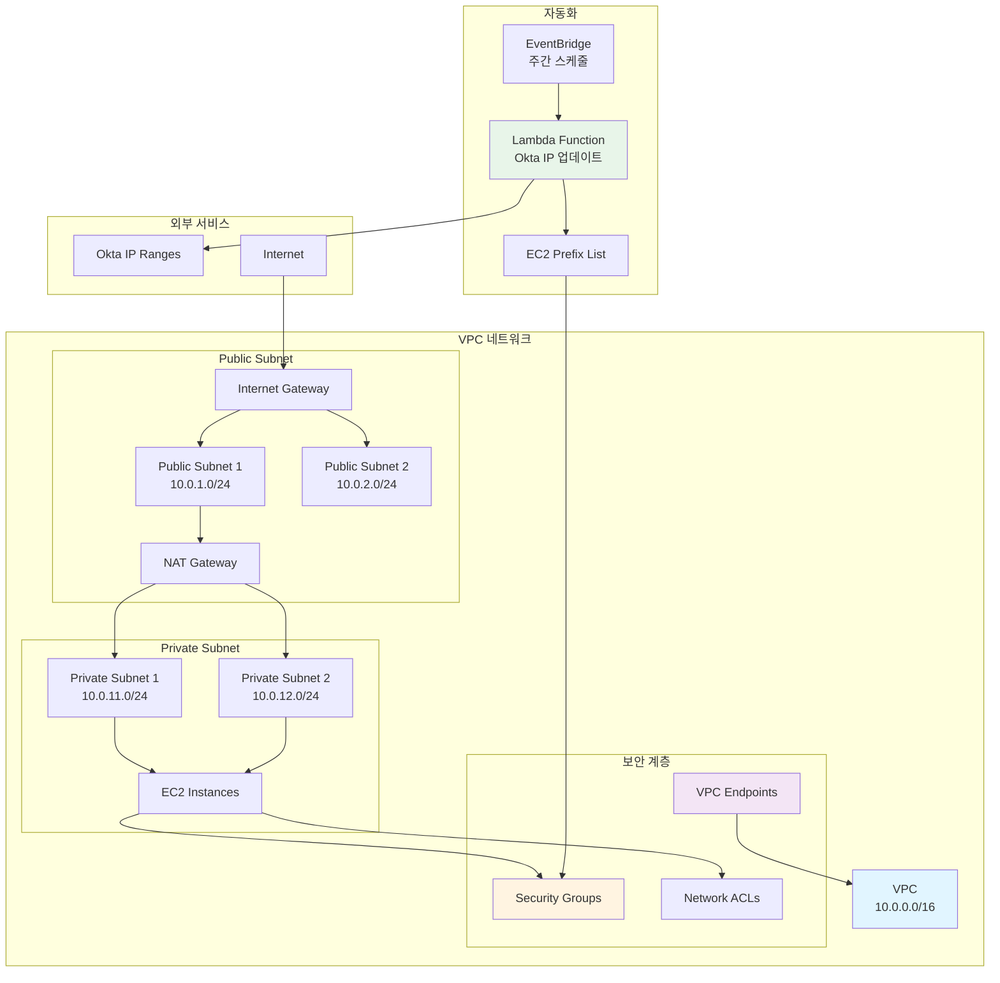
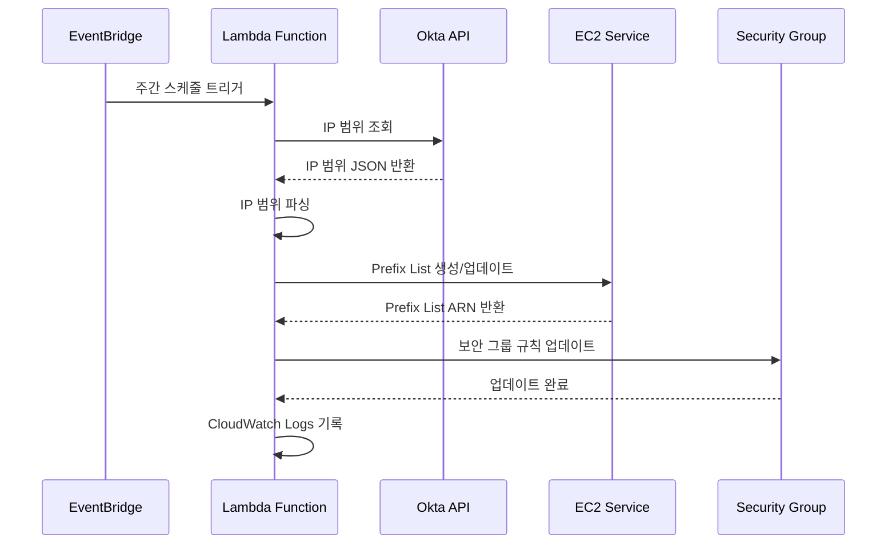
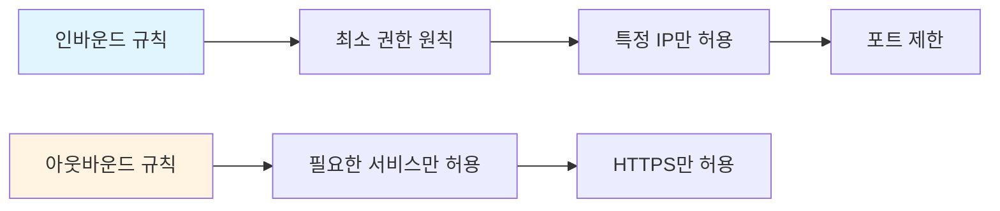

# VPC 네트워크 보안

> AWS VPC 및 네트워크 보안 자동화

이 디렉토리는 AWS VPC(Virtual Private Cloud) 네트워크 보안 설정 및 자동화 스크립트를 포함합니다. Okta IP 범위 관리, 보안 그룹 자동화 등을 제공합니다.

## 📋 목차

- [개요](#개요)
- [VPC 아키텍처](#vpc-아키텍처)
- [프로젝트 구성](#프로젝트-구성)
- [사용 방법](#사용-방법)
- [보안 고려사항](#보안-고려사항)
- [강의 연계](#강의-연계)

## 🎯 개요

VPC는 AWS 클라우드에서 논리적으로 격리된 네트워크 환경을 제공합니다. 이 프로젝트는 다음과 같은 기능을 제공합니다:

- **Okta IP 범위 자동 관리**: Okta IP 범위를 자동으로 가져와 보안 그룹에 적용
- **보안 그룹 자동화**: Lambda 함수를 통한 보안 그룹 자동 업데이트
- **Prefix List 관리**: EC2 Managed Prefix List를 통한 IP 범위 관리

## 🏗️ VPC 아키텍처

### VPC 네트워크 구조



### Okta IP 범위 관리 흐름



### Python 코드로 본 VPC 구조

```python
"""
VPC 네트워크 구조 및 보안 그룹 관리
"""
import boto3
import json
from typing import List, Dict
from dataclasses import dataclass

@dataclass
class Subnet:
    """서브넷 정보"""
    id: str
    cidr: str
    availability_zone: str
    type: str  # 'public' or 'private'

@dataclass
class SecurityGroup:
    """보안 그룹 정보"""
    id: str
    name: str
    description: str
    rules: List[Dict]

class VPCNetwork:
    """VPC 네트워크 클래스"""
    
    def __init__(self, region: str = 'ap-northeast-2'):
        self.ec2_client = boto3.client('ec2', region_name=region)
        self.vpc_id: str = None
        self.subnets: List[Subnet] = []
        self.security_groups: List[SecurityGroup] = []
    
    def create_vpc(self, cidr_block: str = '10.0.0.0/16') -> str:
        """VPC 생성"""
        response = self.ec2_client.create_vpc(
            CidrBlock=cidr_block,
            TagSpecifications=[
                {
                    'ResourceType': 'vpc',
                    'Tags': [
                        {'Key': 'Name', 'Value': 'devsecops-vpc'},
                        {'Key': 'ManagedBy', 'Value': 'Terraform'}
                    ]
                }
            ]
        )
        self.vpc_id = response['Vpc']['VpcId']
        return self.vpc_id
    
    def create_subnet(
        self,
        cidr_block: str,
        availability_zone: str,
        subnet_type: str = 'private'
    ) -> Subnet:
        """서브넷 생성"""
        response = self.ec2_client.create_subnet(
            VpcId=self.vpc_id,
            CidrBlock=cidr_block,
            AvailabilityZone=availability_zone,
            TagSpecifications=[
                {
                    'ResourceType': 'subnet',
                    'Tags': [
                        {'Key': 'Name', 'Value': f'{subnet_type}-subnet'},
                        {'Key': 'Type', 'Value': subnet_type}
                    ]
                }
            ]
        )
        
        subnet = Subnet(
            id=response['Subnet']['SubnetId'],
            cidr=cidr_block,
            availability_zone=availability_zone,
            type=subnet_type
        )
        self.subnets.append(subnet)
        return subnet
    
    def create_security_group(
        self,
        name: str,
        description: str
    ) -> SecurityGroup:
        """보안 그룹 생성"""
        response = self.ec2_client.create_security_group(
            GroupName=name,
            Description=description,
            VpcId=self.vpc_id,
            TagSpecifications=[
                {
                    'ResourceType': 'security-group',
                    'Tags': [
                        {'Key': 'Name', 'Value': name}
                    ]
                }
            ]
        )
        
        sg = SecurityGroup(
            id=response['GroupId'],
            name=name,
            description=description,
            rules=[]
        )
        self.security_groups.append(sg)
        return sg
    
    def add_security_group_rule(
        self,
        security_group_id: str,
        rule_type: str,  # 'ingress' or 'egress'
        protocol: str,
        port: int,
        source: str  # CIDR or Security Group ID
    ):
        """보안 그룹 규칙 추가"""
        if rule_type == 'ingress':
            self.ec2_client.authorize_security_group_ingress(
                GroupId=security_group_id,
                IpPermissions=[
                    {
                        'IpProtocol': protocol,
                        'FromPort': port,
                        'ToPort': port,
                        'IpRanges': [{'CidrIp': source}]
                    }
                ]
            )
        else:
            self.ec2_client.authorize_security_group_egress(
                GroupId=security_group_id,
                IpPermissions=[
                    {
                        'IpProtocol': protocol,
                        'FromPort': port,
                        'ToPort': port,
                        'IpRanges': [{'CidrIp': source}]
                    }
                ]
            )

class OktaIPManager:
    """Okta IP 범위 관리 클래스"""
    
    def __init__(self):
        self.ec2_client = boto3.client('ec2')
        self.okta_url = "https://s3.amazonaws.com/okta-ip-ranges/ip_ranges.json"
    
    def fetch_okta_ips(self) -> List[str]:
        """Okta IP 범위 가져오기"""
        import urllib.request
        
        with urllib.request.urlopen(self.okta_url) as response:
            data = json.loads(response.read())
            return data.get('ip_ranges', [])
    
    def create_prefix_list(
        self,
        name: str,
        ip_ranges: List[str],
        max_entries: int = 100
    ) -> str:
        """EC2 Managed Prefix List 생성"""
        response = self.ec2_client.create_managed_prefix_list(
            PrefixListName=name,
            AddressFamily='IPv4',
            MaxEntries=max_entries,
            Entries=[
                {'Cidr': ip} for ip in ip_ranges
            ],
            TagSpecifications=[
                {
                    'ResourceType': 'prefix-list',
                    'Tags': [
                        {'Key': 'Name', 'Value': name},
                        {'Key': 'Source', 'Value': 'Okta'}
                    ]
                }
            ]
        )
        return response['PrefixList']['PrefixListId']
    
    def update_security_group_with_prefix_list(
        self,
        security_group_id: str,
        prefix_list_id: str,
        port: int = 443
    ):
        """보안 그룹에 Prefix List 적용"""
        self.ec2_client.authorize_security_group_ingress(
            GroupId=security_group_id,
            IpPermissions=[
                {
                    'IpProtocol': 'tcp',
                    'FromPort': port,
                    'ToPort': port,
                    'PrefixListIds': [
                        {'PrefixListId': prefix_list_id}
                    ]
                }
            ]
        )

# Lambda 함수 예제
def lambda_handler(event, context):
    """Okta IP 범위 업데이트 Lambda 함수"""
    manager = OktaIPManager()
    
    # Okta IP 범위 가져오기
    ip_ranges = manager.fetch_okta_ips()
    
    # Prefix List 생성/업데이트
    prefix_list_id = manager.create_prefix_list(
        name='okta-ip-ranges',
        ip_ranges=ip_ranges
    )
    
    # 보안 그룹 업데이트
    security_group_id = os.environ.get('SECURITY_GROUP_ID')
    manager.update_security_group_with_prefix_list(
        security_group_id=security_group_id,
        prefix_list_id=prefix_list_id
    )
    
    return {
        'statusCode': 200,
        'body': json.dumps({
            'message': 'Okta IP ranges updated successfully',
            'prefix_list_id': prefix_list_id
        })
    }
```

## 📝 프로젝트 구성

### 1. Okta IP 범위 관리

**파일**: `okta-ip-sg.py`, `okta-ip-plist.py`

**설명**: Okta IP 범위를 자동으로 가져와 보안 그룹에 적용하는 Lambda 함수

**주요 기능**:
- Okta IP 범위 자동 조회
- EC2 Managed Prefix List 생성/업데이트
- 보안 그룹 규칙 자동 업데이트
- 주간 자동 실행 (EventBridge)

### 2. Terraform 인프라

**파일**: `lambda.tf`, `iam.tf`, `eventbridge.tf`

**설명**: Lambda 함수 및 관련 인프라를 Terraform으로 관리

**주요 리소스**:
- Lambda 함수
- IAM 역할 및 정책
- EventBridge 규칙
- VPC 설정

## 🚀 사용 방법

### 1. Terraform 배포

```bash
# Terraform 초기화
terraform init

# 계획 확인
terraform plan

# 배포
terraform apply
```

### 2. Lambda 함수 수동 실행

```bash
# Lambda 함수 테스트
aws lambda invoke \
  --function-name okta-update-lambda \
  --payload '{}' \
  response.json
```

### 3. 보안 그룹 확인

```bash
# Prefix List 확인
aws ec2 describe-managed-prefix-lists

# 보안 그룹 규칙 확인
aws ec2 describe-security-groups \
  --group-ids sg-xxxxxxxxx
```

## 🔒 보안 고려사항

### 1. 네트워크 격리

- Public/Private 서브넷 분리
- NAT Gateway를 통한 아웃바운드 트래픽 제어
- VPC Endpoint를 통한 AWS 서비스 접근

### 2. 보안 그룹 규칙



### 3. VPC Endpoint

- S3, DynamoDB 등 AWS 서비스에 대한 프라이빗 연결
- 인터넷 게이트웨이를 통하지 않는 안전한 통신

## 📚 강의 연계

이 VPC 프로젝트는 [Twodragon의 클라우드 시큐리티 강의](https://twodragon.tistory.com/category/*%20Twodragon/보안%20강의%20%28Course%29)에서 다룹니다:

- **1주차**: 인프라의 본질 - On-Premise vs Cloud
- **2주차**: AWS 보안 아키텍처 - VPC 네트워크 보안

### 실습 가이드

1. **VPC 생성**: Terraform을 사용한 VPC 및 서브넷 생성
2. **보안 그룹 설정**: 최소 권한 원칙 적용
3. **Okta IP 자동화**: Lambda 함수를 통한 IP 범위 자동 관리
4. **모니터링 설정**: VPC Flow Logs 및 CloudWatch 모니터링

## 📖 참고 자료

- [AWS VPC 공식 문서](https://docs.aws.amazon.com/vpc/)
- [VPC 보안 모범 사례](https://docs.aws.amazon.com/vpc/latest/userguide/security.html)
- [Okta IP 범위](https://s3.amazonaws.com/okta-ip-ranges/ip_ranges.json)

## ⚠️ 주의사항

- VPC CIDR 블록은 겹치지 않도록 주의
- 보안 그룹 규칙은 최소 권한 원칙 적용
- NAT Gateway 비용 고려
- VPC Endpoint 비용 최적화

---

**작성자**: [Twodragon](https://twodragon.tistory.com)  
**강의 블로그**: [클라우드 시큐리티 강의](https://twodragon.tistory.com/category/*%20Twodragon/보안%20강의%20%28Course%29)  
**마지막 업데이트**: 2025-01-27
