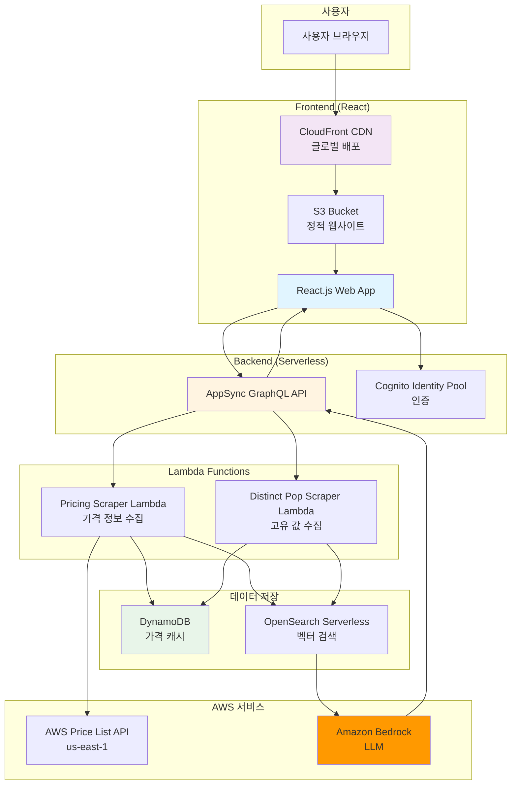
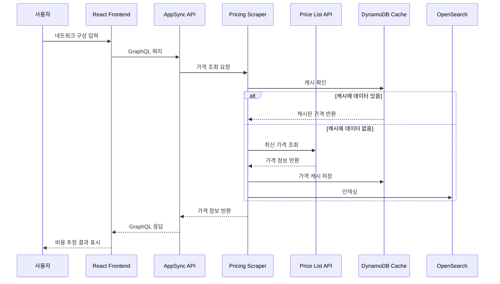
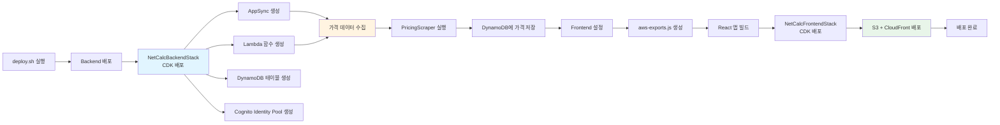
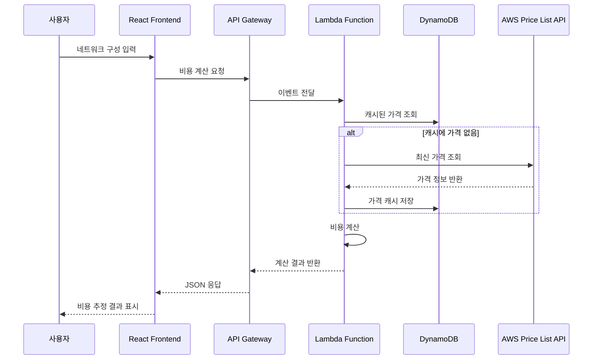
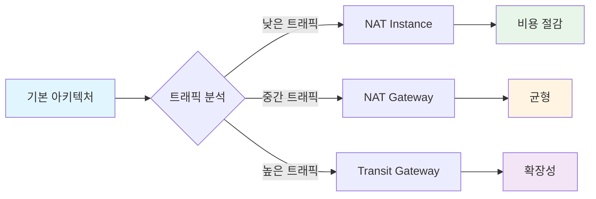

# AWS 네트워크 비용 계산기 (Networking Costs Calculator)

> AWS 네트워킹 비용을 추정하는 셀프 호스팅 계산기

이 프로젝트는 AWS 네트워킹 서비스의 비용을 추정하는 웹 애플리케이션입니다. Data Transfer, Transit Gateway Attachments, NAT Gateways 등의 네트워킹 비용을 계산할 수 있습니다.

## 📌 프로젝트 정보

**원본 리포지토리**: [aws-samples/networking-costs-calculator](https://github.com/aws-samples/networking-costs-calculator)

이 프로젝트는 [AWS 샘플 프로젝트](https://github.com/aws-samples/networking-costs-calculator)의 소스 코드를 직접 활용하며, 서브모듈이 아닌 독립적인 프로젝트로 구성되어 있습니다. 원본 리포지토리의 모든 기능과 구조를 그대로 사용합니다.

**라이선스**: MIT-0 License (원본과 동일)

## 📋 목차

- [개요](#개요)
- [아키텍처](#아키텍처)
- [주요 기능](#주요-기능)
- [사전 요구 사항](#사전-요구-사항)
- [배포 방법](#배포-방법)
- [사용 방법](#사용-방법)
- [비용 최적화 전략](#비용-최적화-전략)
- [강의 연계](#강의-연계)

## 🎯 개요

AWS 네트워킹 비용은 복잡하고 예측하기 어렵습니다. 이 계산기는 다음과 같은 네트워킹 서비스의 비용을 추정합니다:

- **Data Transfer**: 리전 간, 인터넷으로의 데이터 전송 비용
- **Transit Gateway**: Transit Gateway Attachments 및 데이터 처리 비용
- **NAT Gateway**: NAT Gateway 시간당 요금 및 데이터 처리 비용
- **VPC Endpoints**: VPC Endpoint 시간당 요금 및 데이터 처리 비용
- **Direct Connect**: Direct Connect 연결 비용
- **CloudFront**: CloudFront 데이터 전송 비용

## 🏗️ 아키텍처

### 전체 시스템 아키텍처



### 가격 정보 수집 및 캐싱 흐름



### 배포 프로세스



### 데이터 흐름



### Python 코드로 본 비용 계산 구조

```python
"""
AWS 네트워크 비용 계산기 구조
"""
import boto3
from typing import Dict, List, Optional
from dataclasses import dataclass
from decimal import Decimal

@dataclass
class NetworkComponent:
    """네트워크 구성 요소"""
    name: str
    type: str  # 'nat-gateway', 'transit-gateway', 'data-transfer'
    region: str
    quantity: Decimal
    unit: str

@dataclass
class CostEstimate:
    """비용 추정 결과"""
    component: NetworkComponent
    hourly_cost: Decimal
    monthly_cost: Decimal
    data_transfer_cost: Decimal
    total_cost: Decimal

class NetworkCostCalculator:
    """네트워크 비용 계산기"""
    
    def __init__(self, region: str = 'ap-northeast-2'):
        self.pricing_client = boto3.client('pricing', region_name='us-east-1')
        self.dynamodb = boto3.resource('dynamodb', region_name=region)
        self.price_cache_table = self.dynamodb.Table('NetworkPriceCache')
        self.region = region
    
    def get_price(
        self,
        service_code: str,
        filters: List[Dict]
    ) -> Optional[Decimal]:
        """AWS Price List API에서 가격 조회"""
        # DynamoDB 캐시 확인
        cache_key = f"{service_code}:{self._hash_filters(filters)}"
        cached_price = self._get_cached_price(cache_key)
        
        if cached_price:
            return Decimal(str(cached_price))
        
        # Price List API 조회
        try:
            response = self.pricing_client.get_products(
                ServiceCode=service_code,
                Filters=filters,
                MaxResults=1
            )
            
            if response['PriceList']:
                price = self._parse_price(response['PriceList'][0])
                # 캐시 저장
                self._cache_price(cache_key, price)
                return price
        except Exception as e:
            print(f"Error fetching price: {e}")
        
        return None
    
    def calculate_nat_gateway_cost(
        self,
        hours: Decimal = Decimal('730'),  # 월 730시간
        data_transfer_gb: Decimal = Decimal('0')
    ) -> CostEstimate:
        """NAT Gateway 비용 계산"""
        # NAT Gateway 시간당 요금
        filters = [
            {'Type': 'TERM_MATCH', 'Field': 'serviceCode', 'Value': 'AmazonEC2'},
            {'Type': 'TERM_MATCH', 'Field': 'location', 'Value': 'Asia Pacific (Seoul)'},
            {'Type': 'TERM_MATCH', 'Field': 'productFamily', 'Value': 'NAT Gateway'}
        ]
        
        hourly_price = self.get_price('AmazonEC2', filters) or Decimal('0.045')
        
        # 데이터 처리 비용 (GB당)
        data_filters = [
            {'Type': 'TERM_MATCH', 'Field': 'serviceCode', 'Value': 'AmazonEC2'},
            {'Type': 'TERM_MATCH', 'Field': 'location', 'Value': 'Asia Pacific (Seoul)'},
            {'Type': 'TERM_MATCH', 'Field': 'usagetype', 'Value': 'NatGateway-Bytes'}
        ]
        
        data_price_per_gb = self.get_price('AmazonEC2', data_filters) or Decimal('0.045')
        
        hourly_cost = hourly_price
        monthly_cost = hourly_price * hours
        data_transfer_cost = data_price_per_gb * data_transfer_gb
        total_cost = monthly_cost + data_transfer_cost
        
        component = NetworkComponent(
            name='NAT Gateway',
            type='nat-gateway',
            region=self.region,
            quantity=Decimal('1'),
            unit='hour'
        )
        
        return CostEstimate(
            component=component,
            hourly_cost=hourly_cost,
            monthly_cost=monthly_cost,
            data_transfer_cost=data_transfer_cost,
            total_cost=total_cost
        )
    
    def calculate_transit_gateway_cost(
        self,
        attachments: int = 1,
        data_transfer_gb: Decimal = Decimal('0')
    ) -> CostEstimate:
        """Transit Gateway 비용 계산"""
        # Attachment 시간당 요금
        attachment_hourly = Decimal('0.05')  # 예시 가격
        
        # 데이터 처리 비용
        data_price_per_gb = Decimal('0.02')  # 예시 가격
        
        hourly_cost = attachment_hourly * attachments
        monthly_cost = hourly_cost * Decimal('730')
        data_transfer_cost = data_price_per_gb * data_transfer_gb
        total_cost = monthly_cost + data_transfer_cost
        
        component = NetworkComponent(
            name='Transit Gateway',
            type='transit-gateway',
            region=self.region,
            quantity=Decimal(str(attachments)),
            unit='attachment'
        )
        
        return CostEstimate(
            component=component,
            hourly_cost=hourly_cost,
            monthly_cost=monthly_cost,
            data_transfer_cost=data_transfer_cost,
            total_cost=total_cost
        )
    
    def calculate_data_transfer_cost(
        self,
        source_region: str,
        destination: str,  # 'internet', 'same-region', 'other-region'
        data_gb: Decimal
    ) -> Decimal:
        """데이터 전송 비용 계산"""
        if destination == 'internet':
            # 인터넷으로의 데이터 전송 (첫 10TB: $0.09/GB)
            if data_gb <= Decimal('10240'):
                return data_gb * Decimal('0.09')
            else:
                return (Decimal('10240') * Decimal('0.09')) + \
                       ((data_gb - Decimal('10240')) * Decimal('0.085'))
        
        elif destination == 'same-region':
            # 같은 리전 내 전송은 무료
            return Decimal('0')
        
        else:
            # 다른 리전으로의 전송
            return data_gb * Decimal('0.02')
    
    def _get_cached_price(self, cache_key: str) -> Optional[Decimal]:
        """DynamoDB에서 캐시된 가격 조회"""
        try:
            response = self.price_cache_table.get_item(
                Key={'CacheKey': cache_key}
            )
            if 'Item' in response:
                return Decimal(str(response['Item']['Price']))
        except Exception as e:
            print(f"Error reading cache: {e}")
        return None
    
    def _cache_price(self, cache_key: str, price: Decimal):
        """가격을 DynamoDB에 캐시"""
        try:
            self.price_cache_table.put_item(
                Item={
                    'CacheKey': cache_key,
                    'Price': str(price),
                    'TTL': int(time.time()) + 86400  # 24시간 TTL
                }
            )
        except Exception as e:
            print(f"Error caching price: {e}")
    
    def _hash_filters(self, filters: List[Dict]) -> str:
        """필터 해시 생성"""
        import hashlib
        import json
        return hashlib.md5(json.dumps(filters, sort_keys=True).encode()).hexdigest()
    
    def _parse_price(self, price_list_item: str) -> Decimal:
        """Price List API 응답에서 가격 파싱"""
        import json
        product = json.loads(price_list_item)
        terms = product.get('terms', {})
        
        # OnDemand 가격 추출
        on_demand = terms.get('OnDemand', {})
        if on_demand:
            price_dimensions = list(on_demand.values())[0].get('priceDimensions', {})
            if price_dimensions:
                price_per_unit = list(price_dimensions.values())[0].get('pricePerUnit', {})
                if 'USD' in price_per_unit:
                    return Decimal(price_per_unit['USD'])
        
        return Decimal('0')

# Lambda 함수 예제
def lambda_handler(event, context):
    """비용 계산 Lambda 핸들러"""
    calculator = NetworkCostCalculator()
    
    # 요청 파라미터 파싱
    component_type = event.get('component_type')
    params = event.get('params', {})
    
    if component_type == 'nat-gateway':
        estimate = calculator.calculate_nat_gateway_cost(
            hours=Decimal(str(params.get('hours', 730))),
            data_transfer_gb=Decimal(str(params.get('data_transfer_gb', 0)))
        )
    elif component_type == 'transit-gateway':
        estimate = calculator.calculate_transit_gateway_cost(
            attachments=params.get('attachments', 1),
            data_transfer_gb=Decimal(str(params.get('data_transfer_gb', 0)))
        )
    else:
        return {
            'statusCode': 400,
            'body': json.dumps({'error': 'Invalid component type'})
        }
    
    return {
        'statusCode': 200,
        'body': json.dumps({
            'component': estimate.component.name,
            'hourly_cost': str(estimate.hourly_cost),
            'monthly_cost': str(estimate.monthly_cost),
            'data_transfer_cost': str(estimate.data_transfer_cost),
            'total_cost': str(estimate.total_cost)
        })
    }
```

## 🚀 주요 기능

### 1. 실시간 가격 조회
- AWS Price List API를 통한 최신 가격 정보
- DynamoDB를 통한 가격 캐싱으로 성능 최적화

### 2. 다양한 네트워크 구성 요소 지원
- NAT Gateway
- Transit Gateway
- VPC Endpoints
- Data Transfer (리전 간, 인터넷)
- Direct Connect
- CloudFront

### 3. 리전별 가격 비교
- 여러 AWS 리전의 가격 비교
- 리전별 최적화 추천

### 4. 비용 최적화 제안
- 비용 절감 방안 제안
- 아키텍처 패턴별 비용 비교

## 📋 사전 요구 사항

### 필수 도구
- **Node.js**: 버전 18 이상
- **npm**: Node.js와 함께 설치
- **AWS CDK**: `npm install -g aws-cdk`로 설치
- **AWS CLI**: v2 이상 설치 및 구성
- **Linux 기반 OS**: (Windows 배포 스크립트는 아직 지원하지 않음)

### AWS 계정 설정
- AWS 계정 및 적절한 권한
- CDK 부트스트랩 완료: `npx cdk bootstrap aws://ACCOUNT_ID/REGION`

### 설치 확인

```bash
# Node.js 및 npm 버전 확인
npm -v && node -v
# 예상 출력: 7.24.2, v18.16.1

# AWS CDK 버전 확인
cdk --version
# 예상 출력: 2.124.0

# AWS CLI 설정 확인
aws sts get-caller-identity
# 계정 정보 출력 확인
```

## 🚀 배포 방법

이 프로젝트는 [AWS 샘플 프로젝트](https://github.com/aws-samples/networking-costs-calculator)를 기반으로 하며, 원본 리포지토리의 구조와 배포 방식을 그대로 사용합니다.

### 1. 저장소 클론

```bash
git clone <repository_url>
cd networking-costs-calculator
```

### 2. 배포 스크립트 실행 (권장)

원본 리포지토리의 `deploy.sh` 스크립트를 사용하여 자동 배포:

```bash
# 배포 스크립트 실행
./deploy.sh
```

배포 스크립트는 다음을 수행합니다:
1. **Backend 배포**: CDK를 사용하여 NetCalcBackendStack 배포
   - AppSync GraphQL API
   - Lambda 함수 (PricingScraper, DistinctPopScraper)
   - DynamoDB 테이블 (가격 캐시)
   - Cognito Identity Pool
2. **가격 데이터 수집**: PricingScraper Lambda 함수를 처음 실행하여 가격 데이터 수집
3. **Frontend 설정**: Backend 출력값을 사용하여 `aws-exports.js` 생성
4. **Frontend 빌드**: React 앱 빌드
5. **Frontend 배포**: CDK를 사용하여 NetCalcFrontendStack 배포
   - S3 버킷 (정적 웹사이트 호스팅)
   - CloudFront 배포

배포 완료 후 CloudFront URL이 출력됩니다.

### 3. 수동 배포

#### Backend 배포

```bash
cd backend
npm install
npm run build
cdk deploy NetCalcBackendStack --require-approval never
```

#### 가격 데이터 수집

```bash
# PricingScraper Lambda 함수 실행
export NETCALC_SCRAPER_LAMBDA=$(aws cloudformation describe-stacks --stack-name NetCalcBackendStack --query "Stacks[0].Outputs[?OutputKey=='pricingScraperLambda'].OutputValue" --output text)
aws lambda invoke --function-name $NETCALC_SCRAPER_LAMBDA --cli-read-timeout 0 --cli-binary-format raw-in-base64-out tmpresponse.json
rm -f tmpresponse.json
```

#### Frontend 설정 및 배포

```bash
# Backend 출력값 가져오기
export NETCALC_API_URL=$(aws cloudformation describe-stacks --stack-name NetCalcBackendStack --query "Stacks[0].Outputs[?OutputKey=='apiUrl'].OutputValue" --output text)
export NETCALC_CIDP_ID=$(aws cloudformation describe-stacks --stack-name NetCalcBackendStack --query "Stacks[0].Outputs[?OutputKey=='identityPoolId'].OutputValue" --output text)
arrIN=(${NETCALC_CIDP_ID//:/ })
export NETCALC_REGION=${arrIN[0]}

# aws-exports.js 생성
cat <<EOF > frontend/src/aws-exports.js
const awsconfig = {
    "aws_project_region": "$NETCALC_REGION",
    "aws_cognito_identity_pool_id": "$NETCALC_CIDP_ID",
    "aws_cognito_region": "$NETCALC_REGION",
    "aws_appsync_graphqlEndpoint": "$NETCALC_API_URL",
    "aws_appsync_region": "$NETCALC_REGION",
    "aws_appsync_authenticationType": "AWS_IAM",
    "API": {
        "NetCalcAPI": {
            "endpoint": "$NETCALC_API_URL",
            "authMode": "iam"
        }
    }
};
export default awsconfig;
EOF

# Frontend 빌드 및 배포
cd frontend
npm install
npm run build
cd ../backend
cdk deploy NetCalcFrontendStack --require-approval never
```

## 💻 사용 방법

### 1. 웹 애플리케이션 접근

배포 완료 후 CloudFront URL 또는 S3 웹사이트 엔드포인트에 접근합니다.

### 2. 비용 계산

1. **리전 선택**: 상단 오른쪽 드롭다운에서 AWS 리전 선택
2. **서비스 선택**: 관심 있는 네트워킹 서비스 선택
3. **입력 값 입력**: 데이터 전송량, Gateway 개수 등 입력
4. **비용 확인**: 월별 반복 비용 추정 확인

### 3. API 사용

```bash
# NAT Gateway 비용 계산
curl -X POST https://your-api-gateway-url/calculate \
  -H "Content-Type: application/json" \
  -d '{
    "component_type": "nat-gateway",
    "params": {
      "hours": 730,
      "data_transfer_gb": 1000
    }
  }'
```

## 💰 비용 최적화 전략

### 1. NAT Gateway 최적화



### 2. 데이터 전송 최적화

- **VPC Endpoints 활용**: 같은 리전 내 전송은 무료
- **CloudFront 활용**: 인터넷 전송 비용 절감
- **Direct Connect**: 대용량 전송 시 비용 절감

### 3. Transit Gateway 최적화

- Attachment 통합으로 비용 절감
- 리전 간 전송 최소화
- VPC Endpoints와 조합

## 📚 강의 연계

이 프로젝트는 [Twodragon의 클라우드 시큐리티 강의](https://twodragon.tistory.com/category/*%20Twodragon/보안%20강의%20%28Course%29) **3주차: FinOps & ISMS-P**에서 다룹니다.

### 강의 내용

- AWS 네트워킹 비용 구조 이해
- 비용 최적화 전략
- FinOps 아키텍처 설계
- 비용 모니터링 및 알림 설정

### 실습 가이드

1. **비용 계산기 배포**: CDK를 사용한 인프라 배포
2. **비용 분석**: 다양한 아키텍처 패턴의 비용 비교
3. **최적화 실습**: 비용 절감 방안 적용

## 📖 참고 자료

- **[AWS 샘플 프로젝트](https://github.com/aws-samples/networking-costs-calculator)** - 원본 프로젝트 (이 프로젝트의 기반)
- [AWS Price List API](https://docs.aws.amazon.com/awsaccountbilling/latest/aboutv2/price-changes.html)
- [AWS 네트워킹 가격](https://aws.amazon.com/pricing/networking/)
- [AWS CDK 문서](https://docs.aws.amazon.com/cdk/)
- [AWS AppSync 문서](https://docs.aws.amazon.com/appsync/)
- [AWS Cognito Identity Pools](https://docs.aws.amazon.com/cognito/latest/developerguide/identity-pools.html)

## 📁 프로젝트 구조

원본 리포지토리 구조를 그대로 유지합니다:

```
networking-costs-calculator/
├── backend/                 # CDK Backend 프로젝트
│   ├── bin/
│   │   └── backend.ts      # CDK 앱 진입점
│   ├── lib/
│   │   ├── backend-stack.ts    # Backend 스택 (AppSync, Lambda, DynamoDB)
│   │   ├── frontend-stack.ts   # Frontend 스택 (S3, CloudFront)
│   │   ├── functions/
│   │   │   ├── PricingScraper/     # 가격 정보 수집 Lambda
│   │   │   └── DistinctPopScraper/ # 고유 값 수집 Lambda
│   │   └── graphql/
│   │       └── schema.graphql      # GraphQL 스키마
│   ├── package.json
│   └── cdk.json
├── frontend/               # React Frontend 프로젝트
│   ├── src/
│   │   ├── App.js          # 메인 앱 컴포넌트
│   │   ├── Calc/           # 계산기 컴포넌트
│   │   ├── Main/           # 메인 UI 컴포넌트
│   │   └── graphql/        # GraphQL 쿼리
│   ├── public/
│   │   └── img/            # 이미지 및 아이콘
│   └── package.json
├── deploy.sh               # 자동 배포 스크립트
├── LICENSE                 # MIT-0 라이선스
├── CODE_OF_CONDUCT.md
├── CONTRIBUTING.md
└── README.md
```

## 🗑️ 리소스 삭제

원본 리포지토리와 동일한 방식으로 리소스를 삭제합니다:

```bash
cd backend
cdk destroy NetCalcFrontendStack
cdk destroy NetCalcBackendStack
```

또는 모든 스택을 한 번에 삭제:

```bash
cd backend
cdk destroy --all
```

## ⚠️ 주의사항

- Price List API는 us-east-1 리전에서만 사용 가능
- DynamoDB 캐시 TTL 설정으로 최신 가격 보장
- CloudFront 배포는 시간이 걸릴 수 있음
- 실제 비용은 사용량에 따라 달라질 수 있음

## 📄 라이선스

이 프로젝트는 MIT-0 라이선스 하에 제공됩니다. 자세한 내용은 [LICENSE](../LICENSE) 파일을 참조하세요.

---

**작성자**: [Twodragon](https://twodragon.tistory.com)  
**강의 블로그**: [클라우드 시큐리티 강의](https://twodragon.tistory.com/category/*%20Twodragon/보안%20강의%20%28Course%29)  
**참고 프로젝트**: [AWS 샘플 - Networking Costs Calculator](https://github.com/aws-samples/networking-costs-calculator)  
**마지막 업데이트**: 2025-01-27

